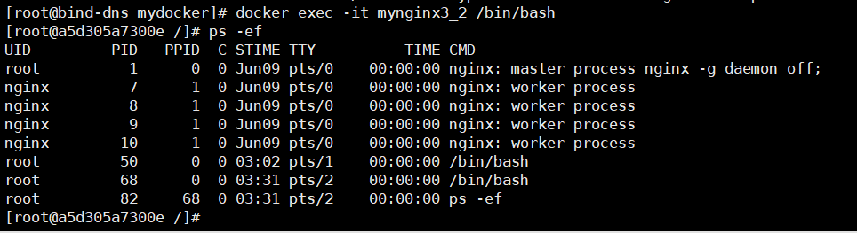

Dockerfile中ENTRYPOINT和CMD的区别
==


## 示例
* 测试环境
    ```text
    OS：CentOS Linux release 7.9.2009 (Core)
    Docker: docker-ce-20.10.6-3.el7.x86_64
    ```

### ENTRYPOINT []
exec form

* Dockerfile

    /mydocker/Dockerfile
    ```text
    FROM centos
    LABEL maintainer="NGINX Docker Maintainers <docker-maint@nginx.com>"
    RUN yum install -y nginx
    RUN echo "nginx web test" > /usr/share/nginx/html/index.html
    EXPOSE 80
    # 也可写成 ENTRYPOINT ["nginx"]，会自动从环境变量中查找可执行的nginx命令
    ENTRYPOINT ["/usr/sbin/nginx"]
    ```

* 构建镜像
    ```bash
    cd /mydocker
    docker build -t hanxiao/mynginx:2.3 .
    ```

* 测试镜像
    ```text
    docker run --name mynginx2_3 -p 5002:80 -it hanxiao/mynginx:2.3 -g "daemon off;"
    
    # 或
    docker run --name mynginx2_4 -p 5003:80 -it hanxiao/mynginx:2.3 "-g daemon off;"
    ```

    * 镜像后的都是要传递的参数
    
    * 容器启动后，tty会话一直处于光标闪烁状态。`Ctrl + P + Q` 快捷键可以让容器在后台运行
    
    * 小坑
    
        在给/usr/sbin/nginx 传参 "daemon off"少了";"会报下面的错误
    
        ```text
        nginx: [emerg] unexpected end of parameter, expecting ";" in command line
        ```

    * 浏览器访问
        

    * 进入容器查看进程
        ```bash
        docker exec -ti mynginx2_3 /bin/bash
        ```
        

* 其它测试
    * 只查看nginx版本信息
        ```bash
        docker run --rm hanxiao/mynginx:2.3 -V
        ```
        
        
        * 容器启动时执行了：`/usr/sbin/nginx -V`
        * 给`ENTRYPOINT`定义的命令`/usr/sbin/nginx`追加了参数`-V`

    * 假设想在查看nginx版本信息时，再执行`ps -ef`命令
        ```bash
        docker run --rm hanxiao/mynginx:2.3 -V ";ps -ef"
        ```
        报错
        ```text
        nginx: invalid option: ";ps -ef"
        ```
        即容器启动时执行的命令为：`/usr/sbin/nginx -V ";ps -ef"`
    
    * 传递多个参数(超过3个，能成功)
        ```bash
        docker run --rm hanxiao/mynginx:2.3 -t -v -h -V
        
        # 或
        docker run --rm hanxiao/mynginx:2.3 "-t" "-v" "-h" "-V"
        ```
        
        
    * docker run时，多个参数合成一个参数（不可行）
        ```bash
        docker run --rm hanxiao/mynginx:2.3 "-h -v -V -t"
        ```
        报错
        ```text
        nginx: invalid option: " "
        ```
    
    * 结论
    
        docker run 镜像后的参数，相当于新加了一条`CMD`指令（并会覆盖 Dockerfile 中定义的CMD），最后这些参数追加到`ENTRYPOINT []`命令后面作为参数

### CMD []
* Dockerfile

    /mydocker/Dockerfile2
    ```text
    FROM centos
    LABEL maintainer="NGINX Docker Maintainers <docker-maint@nginx.com>"
    RUN yum install -y nginx
    RUN echo "nginx web test" > /usr/share/nginx/html/index.html
    EXPOSE 80
    # 前台启动nignx，命令：nginx -g "daemon off;"
    CMD ["nginx", "-g", "daemon off;"]
    ```

* 构建镜像
    ```bash
    docker build -f /mydocker/Dockerfile2 -t hanxiao/mynginx:3.2 /mydocker
    ```

* 测试镜像
    ```bash
    docker run -d --name mynginx3_2 -p 5003:80 hanxiao/mynginx:3.2
    ```
    
    * 浏览器访问 http://<IP>:5003，访问正常
    
    * 查看容器运行的进程
        ```bash
        docker exec -it mynginx3_2 /bin/bash
        ```
        
    
* 其它测试
    * 假设想在查看nginx版本信息时，再执行`ps -ef`命令
        ```bash
        docker run --rm hanxiao/mynginx:3.2 bin/bash -c "nginx -V; ps -ef"
        ```
        
        
        * 执行成功，容器启动时执行的命令：bin/bash -c nginx -V; ps -ef
        * 已经把`CMD`定义的命令`nginx -g "daemon off;"`覆盖了
        * 尝试了以下启动命令
            ```bash
            docker run --rm hanxiao/mynginx:3.2 "nginx -V; ps -ef"
            docker run --rm hanxiao/mynginx:3.2 "nginx -V &&  ps -ef"
            docker run --rm hanxiao/mynginx:3.2 "/usr/sbin/nginx -V &&  ps -ef"
            docker run --rm hanxiao/mynginx:3.2 "/usr/sbin/nginx -V ; ps -ef"
            docker run --rm hanxiao/mynginx:3.2 "/usr/sbin/nginx -V; ps -ef"
            docker run --rm hanxiao/mynginx:3.2 "/bin/bash -c 'nginx -V ; ps -ef'"
            docker run --rm hanxiao/mynginx:3.2 "/bin/bash -c 'nginx -V'"
            docker run --rm hanxiao/mynginx:3.2 '/bin/bash -c "nginx -V"'
            docker run --rm hanxiao/mynginx:3.2 "/bin/bash -c 'nginx -V'"
            ```
            都提示类似如下的错误
            ```text
            docker: Error response from daemon: OCI runtime create failed: container_linux.go:367: starting container process caused: exec: "/usr/sbin/nginx -V; ps -ef": stat /usr/sbin/nginx -V; ps -ef: no such file or directory: unknown.
            ```

### CMD为ENTRYPOINT []定义默认参数
* Dockerfile

    /mydocker/Dockerfile3
    ```bash
    FROM centos
    LABEL maintainer="NGINX Docker Maintainers <docker-maint@nginx.com>"
    RUN yum install -y nginx
    RUN echo "Nginx Web: CMD defining default arguments for an ENTRYPOINT" > /usr/share/nginx/html/index.html
    EXPOSE 80
    CMD ["-g", "daemon off;"]
    ENTRYPOINT ["/usr/sbin/nginx"]
    ```
    * **其中`CMD`和`ENTRYPOINT`不分先后顺序**，
    
    * 最终执行的命令：`/usr/sbin/nginx -g daemon off;`
    
* 构建镜像
    ```bash
    docker build -f /mydocker/Dockerfile3 -t hanxiao/mynginx:4.1 /mydocker
    ```
* 测试镜像
    * 运行容器
    ```bash
    docker run -d --name mynginx4_1 -p 5040:80 hanxiao/mynginx:4.1
    ```
    
    * 查看容器进程
    ```bash
    docker exec -it mynginx4_1 ps -aux
    ```
    
    
    * 查看 image 详细信息  
        docker inspect hanxiao/mynginx:4.1
        // 或
        docker image inspect hanxiao/mynginx:4.1

        ```json
        [
            {
                ...
                "RepoTags": [
                    "hanxiao/mynginx:4.1"
                ],
                "Config": {
                    ...
                    "ExposedPorts": {
                        "80/tcp": {}
                    },
                    "Env": [
                        "PATH=/usr/local/sbin:/usr/local/bin:/usr/sbin:/usr/bin:/sbin:/bin"
                    ],
                    "Cmd": [
                        "-g",
                        "daemon off;"
                    ],
                    "Volumes": null,
                    "WorkingDir": "",
                    "Entrypoint": [
                        "/usr/sbin/nginx"
                    ],

                },
                ...
            }
        ]
        ```

        * 查看 container 详细信息  
            docker inspect mynginx4_1
            ```json
            [
                {
                    ...
                    // Path 与 Args 即为容器最终启动时的命令
                    "Path": "/usr/sbin/nginx",
                    "Args": [
                        "-g",
                        "daemon off;"
                    ],
                    "HostConfig": {
                        ...
                        "PortBindings": {
                            "80/tcp": [
                                {
                                    "HostIp": "",
                                    "HostPort": "5040"
                                }
                            ]
                        },
                    },
                    "Config": {
                        ...
                        "ExposedPorts": {
                            "80/tcp": {}
                        },
                        "Env": [
                            "PATH=/usr/local/sbin:/usr/local/bin:/usr/sbin:/usr/bin:/sbin:/bin"
                        ],
                        "Cmd": [
                            "-g",
                            "daemon off;"
                        ],
                        "Image": "hanxiao/mynginx:4.1",
                        "Volumes": null,
                        "WorkingDir": "",
                        "Entrypoint": [
                            "/usr/sbin/nginx"
                        ],
                    },
                    "NetworkSettings": {
                        ...
                        "Ports": {
                            "80/tcp": [
                                {
                                    "HostIp": "0.0.0.0",
                                    "HostPort": "5040"
                                },
                                {
                                    "HostIp": "::",
                                    "HostPort": "5040"
                                }
                            ]
                        },
                        ...
                    }
                }
            ]
            ```
    
* 其它测试
    * docker run时传参
        ```bash
        docker run --rm hanxiao/mynginx:4.1 -h
        ```
        
        * 此时已经把`CMD`定义的默认参数`-g daemon off;`覆盖了，替换为`-h`，容器里启动时执行了如下命令
            ```bash
            /usr/sbin/nginx -h
            ```
    
    * 查看 docker run 时传参分析
        ```bash
        docker run -d --name mynginx4_1_2 hanxiao/mynginx:4.1 -h
        ```
    
        ```bash
        ~]# docker logs mynginx4_1_2
        nginx version: nginx/1.14.1
        Usage: nginx [-?hvVtTq] [-s signal] [-c filename] [-p prefix] [-g directives]

        Options:
          -?,-h         : this help
          -v            : show version and exit
          -V            : show version and configure options then exit
          -t            : test configuration and exit
          -T            : test configuration, dump it and exit
          -q            : suppress non-error messages during configuration testing
          -s signal     : send signal to a master process: stop, quit, reopen, reload
          -p prefix     : set prefix path (default: /usr/share/nginx/)
          -c filename   : set configuration file (default: /etc/nginx/nginx.conf)
          -g directives : set global directives out of configuration file
        ```

        docker inspect mynginx4_1_2
        ```json
        [
            {
                "Path": "/usr/sbin/nginx",
                "Args": [
                    "-h"
                ],
                
                "Config": {
                    ...
                    "ExposedPorts": {
                        "80/tcp": {}
                    },
                    "Env": [
                        "PATH=/usr/local/sbin:/usr/local/bin:/usr/sbin:/usr/bin:/sbin:/bin"
                    ],
                    "Cmd": [
                        "-h"
                    ],
                    "Image": "hanxiao/mynginx:4.1",
                    "Volumes": null,
                    "WorkingDir": "",
                    "Entrypoint": [
                        "/usr/sbin/nginx"
                    ],
                    ...
                },
            }
        ]
        ```

        可以发现，先把 images 的 `.[0].Config` 信息复制到容器的配置信息`.[0].Config`，再更新需要更新的 key 值，如 `.[0].Config.Cmd` 的key 值更新为 `["-h"]`

        也就是 `docker run <image> 参数1 参数2 ...` 把参数解析为一个列表 ["参数1", "参数2", ...]，然后再更新 `.[0].Config.Cmd` = ["参数1", "参数2", ...]

        `.[0].Path` 则是 `.[0].Config.Entrypoint[0]`，

        `.[0].Args` 则是 `.[0].Config.Cmd`
        
    
### ENTRYPOINT shell格式
结论：ENTRYPOINT shell格式，`CMD`或`docker run`传递的参数不生效。

是通过 `/bin/sh -c '字符串' 参数1 参数2 ...` 只解析到'字符串'，'字符串'后的参数被忽略 实现的。

* Dockerfile

    /mydocker/Dockerfile4
    ```text
    FROM centos
    LABEL maintainer="NGINX Docker Maintainers <docker-maint@nginx.com>"
    RUN yum install -y nginx
    RUN echo "Nginx Web: CMD defining default arguments for an ENTRYPOINT" > /usr/share/nginx/html/index.html
    EXPOSE 80
    ENTRYPOINT /usr/sbin/nginx -v
    CMD ["-h", "-V"]
    ```
* 构建镜像
    ```bash
    docker build -f /mydocker/Dockerfile4 -t hanxiao/mynginx:7.1 /mydocker
    ```
    
    docker image inspect hanxiao/mynginx:7.1
    ```json
    [
        {
            ...
            "Config": {
                ...
                "ExposedPorts": {
                    "80/tcp": {}
                },
                "Env": [
                    "PATH=/usr/local/sbin:/usr/local/bin:/usr/sbin:/usr/bin:/sbin:/bin"
                ],
                "Cmd": [
                    "-h",
                    "-V"
                ],
                "Volumes": null,
                "WorkingDir": "",
                "Entrypoint": [
                    "/bin/sh",
                    "-c",
                    "/usr/sbin/nginx -v"
                ],
            }
            ...
        }
    ]
    ```

* 测试镜像
    * 运行容器
    ```bash
    docker run --rm hanxiao/mynginx:7.1
    
    docker run --rm hanxiao/mynginx:7.1 -t
    ```
    以上两种条命令的结果都是一样的
    
    说明：ENTRYPOINT没有`CMD`或`docker run`传递的参数，最终只运行了`/usr/sbin/nginx -v`  

    * 分析容器启动时的命令--ENTRYPOINT shell + CMD 默认参数
        ```bash
        ~]# docker run -d --name mynginx7_1_2 hanxiao/mynginx:7.1
        ~]# docker logs mynginx7_1_2
        nginx version: nginx/1.14.1
        ```

        docker inspect mynginx7_1_2
        ```json
        [
            {
                ...
                // Path = .[0].Config.Entrypoint[0]
                "Path": "/bin/sh",
                // Args = .[0].Config.Entrypoint[1 : -1] + .[0].Config.Cmd
                "Args": [
                    "-c",
                    "/usr/sbin/nginx -v",
                    "-h",
                    "-V"
                ],
                "Config": {
                    ...
                    "ExposedPorts": {
                        "80/tcp": {}
                    },
                    "Env": [
                        "PATH=/usr/local/sbin:/usr/local/bin:/usr/sbin:/usr/bin:/sbin:/bin"
                    ],
                    "Cmd": [
                        "-h",
                        "-V"
                    ],
                    "Image": "hanxiao/mynginx:7.1",
                    "Volumes": null,
                    "WorkingDir": "",
                    "Entrypoint": [
                        "/bin/sh",
                        "-c",
                        "/usr/sbin/nginx -v"
                    ],
                }
                ...
            }
        ]
        ```
        这里容器启动时执行的命令为 `/bin/sh -c '/usr/sbin/nginx -v' -h -V`，对于 sh 或 bash -c 只会对紧跟其右则的第一个字符串解析为参数，所以这里的 `-h -V` 就被忽略了，
        多个参数的写法`/bin/sh -c '/usr/sbin/nginx 参数1 参数2 ...'`

        ```
        sh [options] [file]

        bash [options] [file]
        ```

        ```bash
        ~]# docker ps -a --no-trunc |egrep "mynginx7_1_2|ID"
        CONTAINER ID       IMAGE                COMMAND                                   CREATED          STATUS                       PORTS     NAMES
        cfb12646ca0ef...   hanxiao/mynginx:7.1  "/bin/sh -c '/usr/sbin/nginx -v' -h -V"   15 minutes ago   Exited (0) 15 minutes ago              mynginx7_1_2
        ```
        
    * 分析容器启动时的命令--ENTRYPOINT shell + CMD 默认参数 + 传参
        ```bash
        ~]# docker run -d --name mynginx7_1_3 hanxiao/mynginx:7.1 -t
        3aff423116ecc9baebc7b7b130281f354d04a1b908f81d1ccea6d6b49420484b
        [root@bind-dns ~]# 
        [root@bind-dns ~]# docker logs mynginx7_1_3
        nginx version: nginx/1.14.1
        ```

        docker inspect mynginx7_1_3
        ```json
        [
            {
                ...
                // Path = .[0].Config.Entrypoint[0]
                "Path": "/bin/sh",
                // Args = .[0].Config.Entrypoint[1 : -1] + .[0].Config.Cmd
                "Args": [
                    "-c",
                    "/usr/sbin/nginx -v",
                    "-t"
                ],
                "Config": {
                    ...
                    "ExposedPorts": {
                        "80/tcp": {}
                    },
                    "Env": [
                        "PATH=/usr/local/sbin:/usr/local/bin:/usr/sbin:/usr/bin:/sbin:/bin"
                    ],
                    "Cmd": [
                        "-t"
                    ],
                    "Image": "hanxiao/mynginx:7.1",
                    "Volumes": null,
                    "WorkingDir": "",
                    "Entrypoint": [
                        "/bin/sh",
                        "-c",
                        "/usr/sbin/nginx -v"
                    ],
                    ...
                },
            }
        ]
        ```

        ```bash
        ~]# docker ps -a --no-trunc |egrep "mynginx7_1_3|ID"
        CONTAINER ID       IMAGE                COMMAND                                   CREATED          STATUS                       PORTS     NAMES
        3aff423116ecc...   hanxiao/mynginx:7.1  "/bin/sh -c '/usr/sbin/nginx -v' -t"      14 minutes ago   Exited (0) 14 minutes ago              mynginx7_1_3
        ```

## 结论
* CMD和ENTRYPOINT都可以定义容器启动时要执行主命令
* Dockerfile中定义的CMD会被`docker run <image> param1 param2 ...`传递的参数覆盖
* ENTRYPOINT shell格式，不接收`CMD`或`docker run`传递的参数
* ENTRYPOINT [] exec格式，有`docker run`传递的参数时，只追加`docker run`传递的参数，没有时则追加Dockerfile中CMD定义的参数
* ENTRYPOINT与CMD同时存在于Dockerfile中，不区分先后顺序
* ENTRYPOINT []、CMD [] exec格式中，非sh的可执行程序不能使用环境变量
* ENTRYPOINT []、CMD [] exec格式启动的程序PID为1
* ENTRYPOINT、CMD shell格式启动的程序PID不是1，启动的程序是/bin/sh的子进程