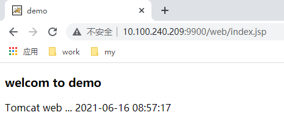

自定义镜像
==

## 自定义Tomcat镜像
* 目录结构
    ```text
    /mydocker/jdk_tomcat
    ├── apache-tomcat-10.0.6.tar.gz
    └── jdk-16.0.1_linux-x64_bin.tar.gz
    ```

* 准备
    假设都下载到`/mydocker/jdk_tomcat`
    * 下载JDK
        
        到[Oracle Java SE Downloads](https://www.oracle.com/java/technologies/javase-downloads.html)下载Linux x64 Compressed Archive(jdk-xx.xx.xx_linux-x64_bin.tar.gz)产品
    * 下载Tomat
    
        到[tomcat.apache.org](http://tomcat.apache.org/)下载稳定版本(tar.gz)
        
* Dockerfile
    ```text
    FROM centos:8
    LABEL maintainer="hanxiao<hanxiao2100@qq.com>" \
        environment="JDK 16, Tomcat 10"
    
    # 从宿主机复制jdk、tomcat包到镜像中，并自动解压tar压缩包
    ADD jdk-16.0.1_linux-x64_bin.tar.gz /usr/local/
    ADD apache-tomcat-10.0.6.tar.gz /usr/local/
    RUN ln -s /usr/local/jdk-16.0.1 /usr/local/jdk; \
            ln -s /usr/local/apache-tomcat-10.0.6 /usr/local/tomcat;
    
    # 设置java、tomcat环境变量
    ENV JAVA_HOME /usr/local/jdk
    ENV CLASSPATH $JAVA_HOME/lib/dt.jar:$JAVA_HOME/lib/tools.jar
    ENV CATALINA_HOME /usr/local/tomcat
    ENV CATALINA_BASE $CATALINA_HOME
    ENV PATH $PATH:$JAVA_HOME/bin:$CATALINA_HOME/bin:$CATALINA_HOME/lib
    
    # 设置工作目录
    WORKDIR $CATALINA_HOME
    
    # 暴露的端口
    EXPOSE 8080/tcp
    
    # 容器启动时执行的命令
    # ENTRYPOINT ["/usr/local/tomcat/startup.sh" ]
    CMD ["catalina.sh", "run"]
    ```
* 构建镜像
    ```bash
    cd /mydocker/jdk_tomcat
    docker build -f ./Dockerfile -t hanxiao2100/tomcat:10 .
    ```
    
    操作日志
    ```bash
    [root@bind-dns jdk_tomcat]# docker build -f ./Dockerfile -t hanxiao2100/tomcat:10 .
    Sending build context to Docker daemon  190.1MB
    Step 1/13 : FROM centos:8
    8: Pulling from library/centos
    Digest: sha256:5528e8b1b1719d34604c87e11dcd1c0a20bedf46e83b5632cdeac91b8c04efc1
    Status: Downloaded newer image for centos:8
     ---> 300e315adb2f
    Step 2/13 : LABEL maintainer="hanxiao<hanxiao2100@qq.com>"     environment="JDK 16, Tomcat 10"
     ---> Running in b4ff9686c39a
    Removing intermediate container b4ff9686c39a
     ---> 2ffe9e358a08
    Step 3/13 : ADD jdk-16.0.1_linux-x64_bin.tar.gz /usr/local/
     ---> e4a3730ab2e6
    Step 4/13 : ADD apache-tomcat-10.0.6.tar.gz /usr/local/
     ---> 98892c4c77cb
    Step 5/13 : RUN ln -s /usr/local/jdk-16.0.1 /usr/local/jdk;         ln -s /usr/local/apache-tomcat-10.0.6 /usr/local/tomcat;
     ---> Running in b40a6ca55070
    Removing intermediate container b40a6ca55070
     ---> 1c4d371ffccf
    Step 6/13 : ENV JAVA_HOME /usr/local/jdk
     ---> Running in 69c4f6b19a0e
    Removing intermediate container 69c4f6b19a0e
     ---> cab04864a698
    Step 7/13 : ENV CLASSPATH $JAVA_HOME/lib/dt.jar:$JAVA_HOME/lib/tools.jar
     ---> Running in 9503e78c272f
    Removing intermediate container 9503e78c272f
     ---> a9e7305fa1ae
    Step 8/13 : ENV CATALINA_HOME /usr/local/tomcat
     ---> Running in 9e7daaa1ba6c
    Removing intermediate container 9e7daaa1ba6c
     ---> d0bf5ecd6b04
    Step 9/13 : ENV CATALINA_BASE $CATALINA_HOME
     ---> Running in 8346076419a5
    Removing intermediate container 8346076419a5
     ---> 7ce6790ccca2
    Step 10/13 : ENV PATH $PATH:$JAVA_HOME/bin:$CATALINA_HOME/bin:$CATALINA_HOME/lib
     ---> Running in d4412a13930b
    Removing intermediate container d4412a13930b
     ---> 3bf6246f0886
    Step 11/13 : WORKDIR $CATALINA_HOME
     ---> Running in 38068348df28
    Removing intermediate container 38068348df28
     ---> 461f4c2d2ba7
    Step 12/13 : EXPOSE 8080/tcp
     ---> Running in a20ae66a50f2
    Removing intermediate container a20ae66a50f2
     ---> 4697b3ce969f
    Step 13/13 : CMD ["catalina.sh", "run"]
     ---> Running in 803bcd3469dd
    Removing intermediate container 803bcd3469dd
     ---> 17a9f513eca2
    Successfully built 17a9f513eca2
    Successfully tagged hanxiao2100/tomcat:10
    [root@bind-dns jdk_tomcat]#
    [root@bind-dns jdk_tomcat]# docker images
    REPOSITORY               TAG       IMAGE ID       CREATED         SIZE
    hanxiao2100/tomcat       10        17a9f513eca2   4 seconds ago   537MB
    ```
* 测试镜像
    * 简单测试
    ```bash
    docker run --rm -p 8800:8080 hanxiao2100/tomcat:10
    ```
    访问 http://<宿主机IP>:8800
    
    * 发布应用
        ```bash
        docker run -d --name mytomcat1 -p 9900:8080 \
            -v /data/web/mytomcat/web:/usr/local/tomcat/webapps/web \
            hanxiao2100/tomcat:10
        ```
    
        在`/data/web/mytomcat/web`目录下新建下列文件
        ```text
        /data/web/mytomcat/web/
        ├── index.jsp
        └── WEB-INF
            └── web.xml
        ```
        * WEB-INF/web.xml
            ```xml
            <?xml version="1.0" encoding="UTF-8"?>
            <web-app xmlns="http://xmlns.jcp.org/xml/ns/javaee"
                     xmlns:xsi="http://www.w3.org/2001/XMLSchema-instance"
                     xsi:schemaLocation="http://xmlns.jcp.org/xml/ns/javaee http://xmlns.jcp.org/xml/ns/javaee/web-app_4_0.xsd"
                     version="4.0">
                 <display-name>demo</display-name>
            </web-app>
            ```
    
        * index.jsp
        ```jsp
        <%@ page contentType="text/html;charset=UTF-8" language="java" %>
        <!DOCTYPE html>
        <html>
          <head>
            <meta http-equiv="Content-Type" content="text/html; charset=UTF-8">
            <title>demo</title>
          </head>
          <body>
            <div>
              <h3>welcom to demo</h3>
              <div>
                <div><%="Tomcat web ..."%>
                  <%= (new java.text.SimpleDateFormat("yyyy-MM-dd hh:mm:ss")).format(new java.util.Date()) %>
                </div>
              </div>
              <% System.out.println(new java.util.Date() + ", request tomcat web."); %>
            </div>
          </body>
        </html>
        ```
        
        * 访问 http://<宿主机IP>:9900/web/index.jsp
            
        * 查看容器日志
            ```bash
            docker logs mytomcat1
            ```
            
            ```text
            ...
            Wed Jun 16 08:57:16 UTC 2021, request tomcat web.
            Wed Jun 16 08:57:17 UTC 2021, request tomcat web.
            Wed Jun 16 08:57:17 UTC 2021, request tomcat web.
            ```