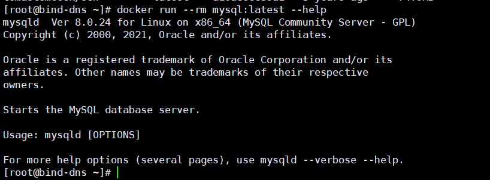

docker-entrypoint.sh分析
==

## docker-entrypoint.sh是什么
在编写Dockerfile的时候，包含一个`ENTRYPOINT ["docker-entrypoint.sh"]`，  
该配置的作用是在容器启动后做一些初始化配置，或者一些自定义的配置等。  
通常是一个脚本，然后在脚本里配置相关预定义项。

[Dockerfile.debian for MySql 8](Dockerfile.debian)  
[Dockerfile.debian MySql 8 in hub.docker.com](https://github.com/docker-library/mysql/blob/a09a716a88ce34a17e16df3f8b091066d90e6f34/8.0/Dockerfile.debian)

```text
FROM debian:buster-slim
...
COPY docker-entrypoint.sh /usr/local/bin/
RUN ln -s usr/local/bin/docker-entrypoint.sh /entrypoint.sh # backwards compat
ENTRYPOINT ["docker-entrypoint.sh"]

EXPOSE 3306 33060
CMD ["mysqld"]
```
docker run不传参的情况下，容器启动后执行 `/usr/local/bin/docker-entrypoint.sh mysqld`


## docker-entrypoint.sh具体内容
[docker-entrypoint.sh for MySql 8](docker-entrypoint.sh)  
[docker-entrypoint.sh for MySql 8 in github](https://github.com/docker-library/mysql/blob/master/8.0/docker-entrypoint.sh)


* docker-entrypoint.sh入口
    ```bash
    # 如果当前脚本正在运行或当前脚本是直接引用其他脚本文件的，则不运行该脚本
    if ! _is_sourced; then
        _main "$@"
    fi
    ```
* _is_sourced()
    ```bash
    # 检测当前脚本文件是否在运行，或者当前脚本是否是直接引用其他脚本文件的
    _is_sourced() {
        # https://unix.stackexchange.com/a/215279
        [ "${#FUNCNAME[@]}" -ge 2 ] \
            && [ "${FUNCNAME[0]}" = '_is_sourced' ] \
            && [ "${FUNCNAME[1]}" = 'source' ]
    }
    ```

* _main()
    ```bash
    _main() {
        # 判断docker run传的参数是否以"-"开头
    	# if command starts with an option, prepend mysqld
    	if [ "${1:0:1}" = '-' ]; then
    		set -- mysqld "$@"
    	fi
        
        # 如果docker run传的第一个参数是"mysqld"，或是传的参数中包含有“-'?'|--help|--print-defaults|-V|--version”中的任意一个，都跳过设置
    	# skip setup if they aren't running mysqld or want an option that stops mysqld
    	if [ "$1" = 'mysqld' ] && ! _mysql_want_help "$@"; then
    		mysql_note "Entrypoint script for MySQL Server ${MYSQL_VERSION} started."
    
    		mysql_check_config "$@"
    		# Load various environment variables
    		docker_setup_env "$@"
    		docker_create_db_directories
            
            # 如果容器是以root身份启动，则以 mysql用户重新运行mysql服务
    		# If container is started as root user, restart as dedicated mysql user
    		if [ "$(id -u)" = "0" ]; then
    			mysql_note "Switching to dedicated user 'mysql'"
    			exec gosu mysql "$BASH_SOURCE" "$@"
    		fi
    
    		# there's no database, so it needs to be initialized
    		if [ -z "$DATABASE_ALREADY_EXISTS" ]; then
    			docker_verify_minimum_env
    
    			# check dir permissions to reduce likelihood of half-initialized database
    			ls /docker-entrypoint-initdb.d/ > /dev/null
    
    			docker_init_database_dir "$@"
    
    			mysql_note "Starting temporary server"
    			docker_temp_server_start "$@"
    			mysql_note "Temporary server started."
    
    			docker_setup_db
    			docker_process_init_files /docker-entrypoint-initdb.d/*
    
    			mysql_expire_root_user
    
    			mysql_note "Stopping temporary server"
    			docker_temp_server_stop
    			mysql_note "Temporary server stopped"
    
    			echo
    			mysql_note "MySQL init process done. Ready for start up."
    			echo
    		fi
    	fi
    	# 最后运行执行命令
    	exec "$@"
    }
    ```


* set -eo pipefail
    * set -e
    
        `set -e`, 这句语句告诉bash如果任何语句的执行结果不是true则应该退出.   
        这样的好处是防止错误像滚雪球般变大导致一个致命的错误,   
        而这些错误本应该在之前就被处理掉.

    * set -o pipefail
    
        Linux 脚本中的管道, 如果前面的命令执行出了问题, 应该立即退出
* shopt -s nullglob

    在使用 Linux 中的通配符时 * ?等 如果没有匹配到任何文件, 不会报 No such file or directory 而是将命令后面的参数去掉执行

* ${1:0:1}
    ```text
    第一个1：表示变量$1，即调用该脚本的第一个参数
    0：$1变量的偏移量0，即不偏移，从左开始
    第二个1：取字符串长度为1，即一个字符
    ```
    上面的这个操作类似于 Python 的字符串切片
    
    示例
    ```bash
    docker run --rm mysql:latest --help
    ```
    
    1. 容器启动时执行了：`/usr/local/bin/docker-entrypoint.sh --help`，  docker run一旦传参，那么默认CMD设置的默认参数会被覆盖
    2. 执行_main()方法，
        ```bash
        _main() {
        	# if command starts with an option, prepend mysqld
        	if [ "${1:0:1}" = '-' ]; then
        		set -- mysqld "$@"
        	fi
        	...
        }
        ```
        因为传参为`--help`，即$1="--help"，第一个字符是`-`开始的，此时的`$@=--help`  
        于是执行`set -- mysqld "$@"`，`$@="mysqld --help"`
    3. exec "$@"
        ```text
        _main() {
           ...
           exec "$@"
        }
        ```
        最后执行命令：`exec mysqld --help`，  
        所以最终就显示了所上图的结果
* exec
    ```text
    exec是bash的内置命令，exec执行命令时，不会启用新的shell进程。
    
    bash或sh执行时，会另起一个子shell进程，其继承父shell进程的环境变量，其子shell进程的变量执行完后不影响父shell进程。
    exec是用被执行的命令行替换掉当前的shell进程，且exec命令后的其他命令将不再执行。
    
    为了避免父shell被退出，一般将exec命令放到一个子shell脚本中，
    在父sehll中调用这个子shell脚本，调用处可以用bash xx.sh(xx.sh为存放exec命令的脚本)，
    这样会为xx.sh建立一个子shell去执行，当执行exec后该子shell进程就被替换成相应的exec的命令。
  
    其中有一个例外：当exec命令对文件描述符操作的时候，就不会替换shell，而是操作完成后还会继续执行后面的命令！
    ```
* set -- mysqld "$@"
    
    使用了 set -- 的用法. set --会将他后面所有以空格区分的字符串, 按顺序分别存储到$1, $2, $3 变量中, 其中新的$@为set --后面的全部内容.
    
    举例来说: bash docker-entrypoint.sh -f xxx.conf
    
    在这种情况下, `set -- mysqld "$@"` 中的 `$@` 的值为 `-f xxx.conf`
    
    当执行完 set -- mysqld "$@" 这条命令后:
    
    * $1=mysqld
    * $2=-f
    * $3=xxx.conf
    * $@=mysqld -f xxx.conf

* shift

    参数的左移。通常用于在不知道传入参数个数的情况下依次遍历每个参数然后进行相应处理（常见于Linux中各种程序的启动脚本）
    
* exec gosu mysql "$BASH_SOURCE" "$@"

    类似`exec sudo mysql "$BASH_SOURCE" "$@"`
    
    * `gosu`是Linux中`sudo`命令的轻量级"替代品",用来提升指定账号的权限
        ```text
        gosu 是一个 golang 语言开发的工具, 用来取代 shell 中的 sudo 命令. su 和 sudo 命令有一些缺陷, 
        主要是会引起不确定的 TTY, 对信号量的转发也存在问题. 
        如果仅仅为了使用特定的用户运行程序, 使用 su 或 sudo 显得太重了, 为此 gosu 应运而生.
        
        
        gosu 直接借用了 libcontainer 在容器中启动应用程序的原理, 使用 /etc/passwd 处理应用程序. 
        
        gosu 首先找出指定的用户或用户组, 然后切换到该用户或用户组. 
        接下来, 使用 exec 启动应用程序. 
        到此为止, gosu 完成了它的工作, 不会参与到应用程序后面的声明周期中. 
        
        使用这种方式避免了 gosu 处理 TTY 和转发信号量的问题, 把这两个工作直接交给了应用程序去完成
        ```
        [gosu](https://github.com/tianon/gosu)
* $BASH_SOURCE

    `exec gosu mysql "$BASH_SOURCE" "$@"`在此Dockerfile则为`exec gosu mysql "/usr/local/bin/docker-entrypoint.sh" "$@"`

    [BASH_SOURCE](https://www.gnu.org/software/bash/manual/html_node/Bash-Variables.html)
    ```text    
    An array variable whose members are the source filenames where the
    corresponding shell function names in the FUNCNAME array variable are
    defined. The shell function ${FUNCNAME[$i]} is defined in the file
    ${BASH_SOURCE[$i]} and called from ${BASH_SOURCE[$i+1]}
    ```
    ${BASH_SOURCE [0]}(或更简单地说,$BASH_SOURCE)包含所有调用方案中包含脚本的(潜在的相对)路径,特别是在脚本来源时,这对于$0不是真的.
    
    * 示例
    
        my.sh
        ```bash 
        #!/bin/sh
        
        echo "$BASH_SOURCE"
        ```
        >bash /root/my.sh aa bb
        
        输出结果
        ```text
        /root/my.sh
        
        ```