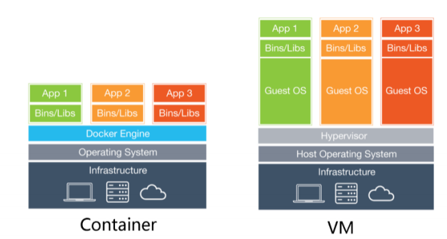
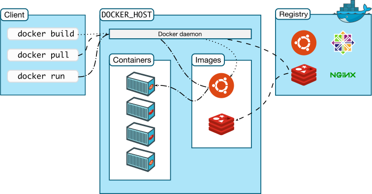
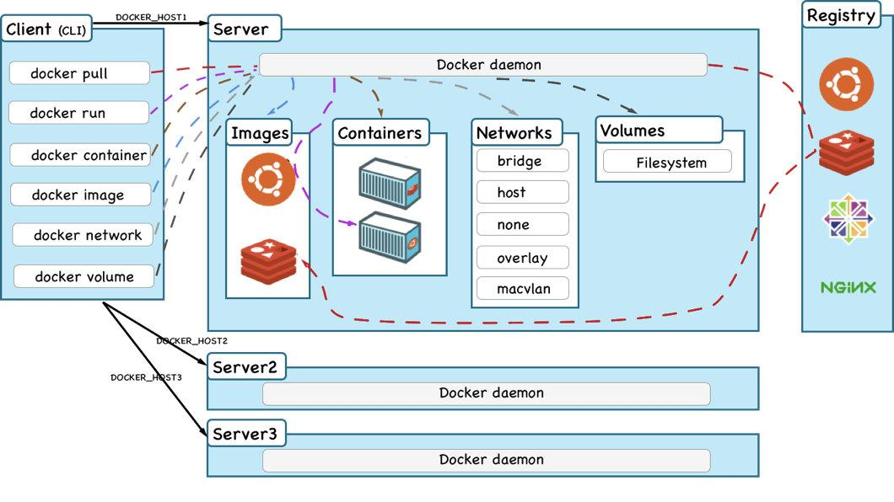
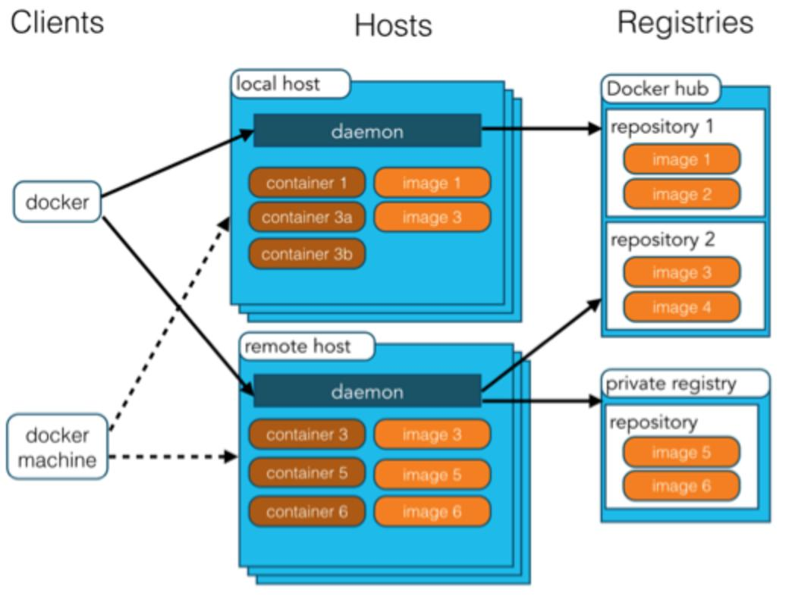
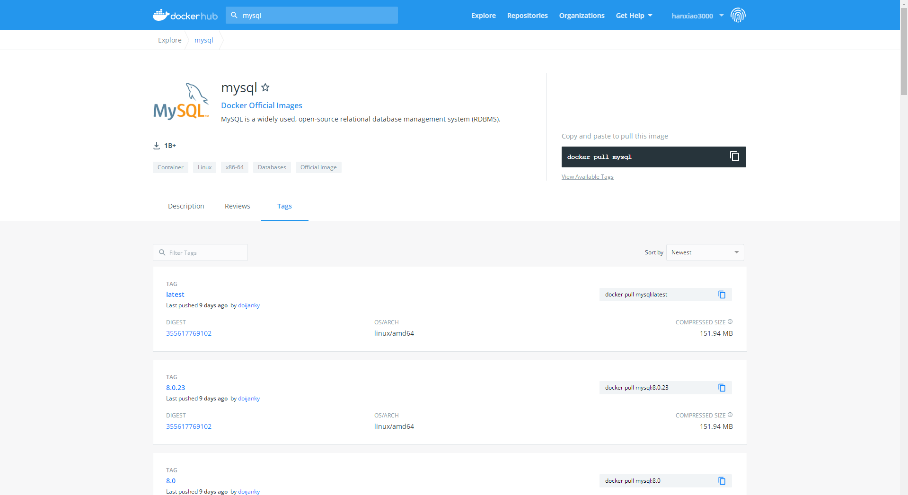
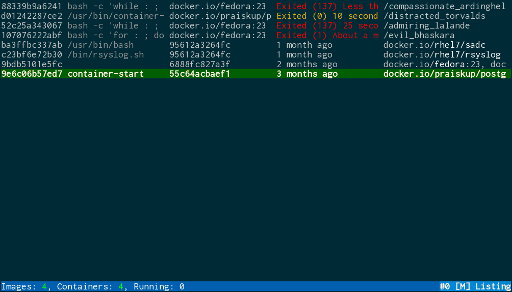

docker的使用
==

## Table Of Contents
* [简介](#简介)
    * [docker容器与VM对比](#docker容器与VM对比)
* [docker结构体系](#docker结构体系)
* [特别说明](#特别说明)
* [安装docker](#安装docker)
    * [CentOS安装Docker Engine](#CentOS安装Docker-Engine)
        * [Prerequisites必要条件](#Prerequisites必要条件)
        * [Installation methods](#Installation-methods)
        * [Uninstall Docker Engine](#Uninstall-Docker-Engine)
    * [配置镜像加速](#配置镜像加速)
* [docker的常用操作](#docker的常用操作)
    * [帮助命令](#帮助命令)
    * [镜像操作](#镜像操作)
    * [容器操作](#容器操作)
        * [docker run](#docker-run)
            * [Set working directory (-w)设置工作目录](#Set-working-directory--w设置工作目录)
            * [Set storage driver options per container设置存储驱动选项](#Set-storage-driver-options-per-container设置存储驱动选项)
            * [Mount tmpfs (--tmpfs)临时文件系统](#Mount-tmpfs---tmpfs临时文件系统)
            * [Mount volume (-v, --read-only)挂载卷](#Mount-volume--v---read-only挂载卷)
            * [Add bind mounts or volumes using the --mount flag](#Add-bind-mounts-or-volumes-using-the---mount-flag)
            * [Set environment variables (-e, --env, --env-file)设置环境变量](#Set-environment-variables--e---env---env-file设置环境变量)
            * [Mount volumes from container (--volumes-from)](#Mount-volumes-from-container---volumes-from)
            * [Add host device to container (--device)](#Add-host-device-to-container---device)
            * [Restart policies (--restart)](#Restart-policies---restart)
        * [退出容器](#退出容器)
        * [进入正在运行的容器并以命令行交互](#进入正在运行的容器并以命令行交互)
        * [容器与host宿主机互拷文件](#容器与host宿主机互拷文件)
        * [Publish port(发布端口，端口映射)](#Publish-port发布端口端口映射)
        * [修改Docker容器启动配置参数](#修改Docker容器启动配置参数)
        * [修改docker容器的挂载路径](#修改docker容器的挂载路径)
        * [修改docker默认的存储位置](#修改docker默认的存储位置)
* [启动mysql容器示例](#启动mysql容器示例)
* [docker清理占用的硬盘空间](#docker清理占用的硬盘空间)
    * [清理磁盘，删除关闭的容器、无用的数据卷和网络、以及无tag的镜像](#清理磁盘删除关闭的容器无用的数据卷和网络以及无tag的镜像)
    * [手动清理Docker镜像、容器、数据卷](#手动清理Docker镜像容器数据卷)
    * [限制容器的日志大小](#限制容器的日志大小)
    * [使用truncate命令将容器的日志文件"清零"](#使用truncate命令将容器的日志文件清零)
* [迁移image、container、volume](#迁移imagecontainervolume)
    * [image迁移](#image迁移)
    * [container迁移](#container迁移)
        * [镜像的迁移参考上面Image的迁移，如image为alpine](#镜像的迁移参考上面Image的迁移如image为alpine)
        * [容器的迁移](#容器的迁移)
    * [volume迁移](#volume迁移)
        * [备份volume](#备份volume)
        * [恢复volume备份文件](#恢复volume备份文件)
    * [迁移image、container、volume总结](#迁移imagecontainervolume总结)
* [tomastomecek/sen--docker engine终端用户界面](#tomastomecek/sen--docker-engine终端用户界面)
* [wagoodman/dive--image,layer contents探索工具](#wagoodman/dive--imagelayer-contents探索工具)
* [注意](#注意)
    * [iptables服务重启后，导致docker的iptables规则丢失解决办法](#iptables服务重启后导致docker的iptables规则丢失解决办法)


## 简介
* docker是什么
    ```text
    Docker是基于Go语言实现的云开源项目。Docker的主要目标是"Build，Ship and Run Any App, Anywhere"
    
    理念：使用应用能够"一次封装，到处运行"
  
    解决了运行环境和配置问题软件容器，方便做持续集成并有助于整体发布的容器虚拟化技术。
    
    **Docker**是一个开源的应用容器引擎；是一个轻量级容器技术；
    
    Docker支持将软件编译成一个镜像；然后在镜像中各种软件做好配置，将镜像发布出去，其他使用者可以直接使用这个镜像；
    
    运行中的这个镜像称为容器，容器启动是非常快速的。
    ```
    
    * docker容器类似一个极简版的mini Linux系统
    * docker的运行机制，一个docker容器同时只能管理一个进程，这个进程退出后，容器也就退出了。  
        也就是至少有一个前台方式运行的进程才能使容器保持运行。

* 官网资料
    * [docker官网](https://www.docker.com/)
    * [官方文档](https://docs.docker.com/)
    * [docker仓库](https://hub.docker.com/)

### docker容器与VM对比
* 为什么docker比VM块
    * docker有着比虚拟机更少的抽象层。
    * docker利用的是宿主机的内核，不需要GuestOS
    

* 细节对比

项 |docker容器 |VM(虚拟机)
:--- |:--- |:---
操作系统 |与宿主机共享OS |宿主机OS上运行虚拟机OS 
存储大小 |镜像小，便于存储与传输 |镜像庞大(vmdk, vdi等) 
运行性能 |几乎无额外性能损失 |VM OS操作系统额外的CPU、内存消耗，损失5%左右
移植性 |轻便、灵活，适用于Linux | 笨重，与虚拟化技术耦合度高，ESXi, hyper-v, KVM
硬件亲和性 |面向开发者 |面向硬件运维者 
部署速度 |快速，秒级 |较慢，分钟级 
单台宿主机可部署数量|100-1000个 |<100台 
宿主机操作系统 |主要支持Linux |几乎所有操作系统 
隔离性 |进程级 |系统级(更彻底)
封装程度 |只打包项目代码和依赖关系，共享宿主机kenel |完整的操作系统  
磁盘占用 |MB级别 |GB级别   


## docker结构体系





**核心概念**
* docker host
    >安装了docker程序的主机

* docker daemon
    >docker守护进程，  
    监听docker API请求，  
    管理 images, containers, networks, and volumes  
    与其他docker services通信

* docker client
    >CLI, 管理docker的客户端
* docker registries
    >镜像仓库  
    A Docker registry stores Docker images.  
    Docker Hub is a public registry

* docker objects
    * images
         >用于创建container的镜像，可以包含一个或一组应用(多个应用)  
         An image is a read-only template with instructions for creating a Docker container. Often, an image is based on another image, with some additional customization.
    * containers
        >容器，一个可运行的镜像实例  
        A container is a runnable instance of an image. 
    * networks
        >网络
    * volumes
        卷，文件系统
    * plugins
        >插件
    * other objects


**使用docker的步骤**
1. 安装docker
2. 去docker registries仓库找到对应的image镜像
3. 使用docker运行这个镜像，就生成了基于这个镜像的docker容器
4. 对容器的启动/停止，可以控制对应用的启动/停止

## 特别说明
* docker的设计与git很类似，如image、registrie、container等
* 当container容器中没有进程在运行时，会自动退出（需要有一个前台进程在运行）。因为它认为没有任务要执行了


## 安装docker
* [Install Docker Engine](https://docs.docker.com/engine/install/)
    * [Install Docker Engine on CentOS](https://docs.docker.com/engine/install/centos/)
    * [Install Docker Engine on Ubuntu](https://docs.docker.com/engine/install/ubuntu/)

### CentOS安装Docker Engine
[Install Docker Engine on CentOS](https://docs.docker.com/engine/install/centos/)

#### Prerequisites必要条件
* OS requirements

    you need a maintained version of CentOS 7 or 8.

    The `centos-extras` repository must be enabled. This repository is enabled by default, but if you have disabled it, you need to [re-enable it](https://wiki.centos.org/AdditionalResources/Repositories)

    The `overlay2` storage driver is recommended.
    
* Uninstall old versions
    ```bash
    yum -y remove docker \
                docker-client \
                docker-client-latest \
                docker-common \
                docker-latest \
                docker-latest-logrotate \
                docker-logrotate \
                docker-engine
     
    ## CentOS 8内置了Podman 开源容器
    yum remove -y podman  # 或 dnf remove -y podman
    yum erase -y podman buildah
    ```
    The contents of `/var/lib/docker/`, including images, containers, volumes, and networks, are preserved(先保存). The Docker Engine package is now called `docker-ce`.


#### Installation methods
* Install using the repository
    * SET UP THE REPOSITORY
        Install the `yum-utils` package (which provides the `yum-config-manager` utility) and set up the **stable** repository.
        ```bash
         yum install -y yum-utils
         yum-config-manager \
            --add-repo https://download.docker.com/linux/centos/docker-ce.repo
        ```
        These repositories are included in the docker.repo file above but are disabled by default. You can enable them alongside the stable repository. The following command enables the **nightly** repository.
        >sudo yum-config-manager --enable docker-ce-nightly
        
        To enable the test channel, run the following command:
        >sudo yum-config-manager --enable docker-ce-test
        
        You can disable the `nightly` or `test` repository by running the `yum-config-manager` command with the `--disable` flag. To re-enable it, use the --enable flag. The following command disables the nightly repository.
        
        >sudo yum-config-manager --disable docker-ce-nightly
  
    * INSTALL DOCKER ENGINE
        * Install the latest version of Docker Engine and containerd
            ```bash
            yum -y install docker-ce docker-ce-cli containerd.io
            ```
            Docker is installed but not started. The `docker` group is created, but no users are added to the group.      
            
        * To install `a specific version` of Docker Engine（安装指定版本的docker引擎）, 
        
            list the available versions in the repo, then select and install:
            ```bash
            yum list docker-ce --showduplicates |sort -r
            #  
            docker-ce.x86_64  3:18.09.1-3.el7                     docker-ce-stable
            docker-ce.x86_64  3:18.09.0-3.el7                     docker-ce-stable
            docker-ce.x86_64  18.06.1.ce-3.el7                    docker-ce-stable
            docker-ce.x86_64  18.06.0.ce-3.el7                    docker-ce-stable
            ```
            fully qualified package name, For example, `docker-ce-18.09.1`
            ```bash
            yum -y install docker-ce-<VERSION_STRING> docker-ce-cli-<VERSION_STRING> containerd.io
            ```
        * Start Docker
            ```bash
            systemctl start docker
            systemctl enable docker  (设置自动启动docker服务)
            ```
        * Verify that Docker Engine is installed correctly by running the `hello-world` image.
            >docker run hello-world
    
    * UPGRADE DOCKER ENGINE
        To upgrade Docker Engine, follow the installation instructions(即安装指定版docker这步), choosing the new version you want to install.
        
* Install from a package
    1. Go to `https://download.docker.com/linux/centos/` and choose your version of CentOS. Then browse to `x86_64/stable/Packages/` and download the `.rpm` file for the Docker version you want to install.
    2. Install Docker Engine, changing the path below to the path where you downloaded the Docker package.
        >yum -y install /path/to/package.rpm

* Install using the convenience script

    Docker provides convenience scripts at `get.docker.com` and `test.docker.com` for installing edge and testing versions of Docker Engine - Community into development environments quickly and non-interactively.
    ```bash
    curl -fsSL https://get.docker.com -o get-docker.sh
    sh get-docker.sh
    
    # 或
    wget -qO- https://get.docker.com |sh
    ```
    
    If you would like to use Docker as a non-root user, you should now consider adding your user to the “docker” group with something like:
    >usermod -aG docker <your-user>

#### Uninstall Docker Engine
1. Uninstall the Docker Engine, CLI, and Containerd packages:
    >yum -y remove docker-ce docker-ce-cli containerd.io

2. Images, containers, volumes, or customized configuration files on your host are not automatically removed. To delete all images, containers, and volumes:
    ```bash
    rm -rf /var/lib/docker
    rm -rf /var/lib/containerd
    ```
    You must delete any edited configuration files manually.

### 配置镜像加速
修改daemon配置文件 /etc/docker/daemon.json 来使用加速器

* 阿里云docker镜像

    参考[镜像加速器](https://cr.console.aliyun.com/cn-hangzhou/instances/mirrors)
    ```bash
    sudo mkdir -p /etc/docker
    sudo tee /etc/docker/daemon.json <<-'EOF'
    {
      "registry-mirrors": ["https://<你的ID>.mirror.aliyuncs.com"]
    }
    EOF
    
    sudo systemctl daemon-reload
    sudo systemctl restart docker
    ```
    我的阿里云 docker镜像加速地址 `https://3bq1z3ee.mirror.aliyuncs.com`
    
* 网易docker镜像
    ```bash
    sudo mkdir -p /etc/docker
    sudo tee /etc/docker/daemon.json <<-'EOF'
    {
      "registry-mirrors": ["https://hub-mirror.c.163.com/"]
    }
    EOF
    
    sudo systemctl daemon-reload
    sudo systemctl restart docker
    ```

* 验证配置的镜像加速是否生效
    ```bash
    docker info
    
    # 看是否有
    Registry Mirrors:
        https://xxx
    ```

## docker的常用操作
[docker CLI命令行](https://docs.docker.com/engine/reference/commandline/docker/)

### 帮助命令
* docker --help

    子命令的帮助
    >docker COMMAND --help 
* docker info
* docker version


### 镜像操作
* 搜索镜像
    ```text
    docker search [OPTIONS] TERM
        
    Search the Docker Hub for images，从https://hub.docker.com/ docker hub中搜索镜像
    
    Options:
      -f, --filter filter   Filter output based on conditions provided
          --format string   Pretty-print search using a Go template
          --limit int       Max number of search results (default 25)
          --no-trunc        Don't truncate output 输出不截断

    ```
    
    示例
    ```text
    docker search mysql
  
    #
    NAME                              DESCRIPTION                                     STARS     OFFICIAL   AUTOMATED
    mysql                             MySQL is a widely used, open-source relation…   10766     [OK]       
    mariadb                           MariaDB Server is a high performing open sou…   4052      [OK]       
    mysql/mysql-server                Optimized MySQL Server Docker images. Create…   792                  [OK]
    percona                           Percona Server is a fork of the MySQL relati…   533       [OK]       
    centos/mysql-57-centos7           MySQL 5.7 SQL database server                   87                   
    mysql/mysql-cluster               Experimental MySQL Cluster Docker images. Cr…   81                   
    centurylink/mysql                 Image containing mysql. Optimized to be link…   59                   [OK]
    bitnami/mysql                     Bitnami MySQL Docker Image                      50                   [OK]
    databack/mysql-backup             Back up mysql databases to... anywhere!         43                   
    ```
    
    各项说明：
    ```text
    NAME：镜像名
    DESCRIPTION：镜像描述
    STARS：关注人数，单位:k
    OFFICIAL：是否为docker官方的，[OK] 是
    AUTOMATED：是否自动构建，[OK] 是
    ```
    

* 拉取镜像
    ```text
    Usage:  docker pull [OPTIONS] NAME[:TAG|@DIGEST]
    
    Pull an image or a repository from a registry  从镜像仓库拉取镜像到服务器本地
    默认是 latest TAG
  
  
    Options:
      -a, --all-tags                Download all tagged images in the repository
          --disable-content-trust   Skip image verification (default true)
          --platform string         Set platform if server is multi-platform capable
      -q, --quiet                   Suppress verbose output
    
    @DIGEST：摘要值指定镜像版本，如
    docker pull mysql@sha256:355617769102e9d2ebb7d5879263a12d230badb7271c91748b2c7b0ac6971083
    ```
    
* 查看本地已经拉取的镜像
    ```text
    Usage:  docker images [OPTIONS] [REPOSITORY[:TAG]]
    
    List images
    
    Options:
      -a, --all             Show all images (default hides intermediate images)
          --digests         Show digests
      -f, --filter filter   Filter output based on conditions provided
          --format string   Pretty-print images using a Go template
          --no-trunc        Don't truncate output
      -q, --quiet           Only show image IDs

    ```
    
    
* 删除本地镜像
    ```text
    Usage:  docker rmi [OPTIONS] IMAGE [IMAGE...]
    
    Remove one or more images  删除指定的一个或多个镜像指定镜像的ID
    
    Options:
      -f, --force      Force removal of the image
          --no-prune   Do not delete untagged parents
    ```

* 查看镜像制作的历史
    [docker history](https://docs.docker.com/engine/reference/commandline/history/)
    可具体的制作步骤
    ```bash
    docker history --no-trunc <IMAGE>
    # 等价于下面的命令
    docker image history [OPTIONS] IMAGE
    
    # 自定义格式
    docker history --no-trunc --format "{{.CreatedAt}} | {{.CreatedBy}}  |{{.Comment}}" <IMAGE>
    ```
* 查看镜像的详细信息
    ```bash
    docker image inspect [OPTIONS] IMAGE [IMAGE...]
    ```
* 删除所有的image
    ```bash
    docker rmi -f `docker images -qa`
   
    或
    docker rmi -f `docker images --format "{{.ID}}"`
    
    删除所有 tag为none的镜像
    docker rmi -f `docker images -f dangling=true -q`
    ```

### 容器操作
* 搜索镜像
    >docker search tomcat
    
* 拉取镜像
    >docker pull tomcat

* 根据镜像启动容器，一般不使用，

    容器内部的端口没有映射出来，容器内的端口无法被访问到
    >docker run --name mytomcat -d tomcat:latest

* 根据镜像启动容器，并做端口映射，默认是TCP
    >docker run --name mytomcat --restart=always -d -p 8888:8080 tomcat
    
    http://host-ip:8888 浏览

* 重命名容器
    >docker rename CONTAINER NEW_NAME
    
    
* 停止运行中的容器
    >docker stop [OPTIONS] CONTAINER [CONTAINER...]  
    docker stop CONTAINER_ID
    
* 强制停止容器
    >docker kill [OPTIONS] CONTAINER [CONTAINER...]  
    docker kill CONTAINER_ID

* 查看所有的容器，包括停止运行的
    >docker ps -a  

* 启动容器
    >docker start [OPTIONS] CONTAINER [CONTAINER...]  
    docker start CONTAINER_ID
    
* 删除指定的容器
    >docker rm [OPTIONS] CONTAINER [CONTAINER...]  
    docker rm CONTAINER_ID

* 删除所有的容器
    >docker rm -fv $(docker ps -a --format "{{.ID}}")

* 删除所有已经退出的容器
    >docker rm -v $(docker ps -aq -f status=exited)

* 向运行的指定容器中执行命令
    >docker exec -it CONTAINER_ID bash  
    // This will create a new Bash session in the container CONTAINER_ID 新建一个bash会话，此时就能在此session中输入命令

    ````text
    docker container exec <CONTAINER_ID> \
        bash -c 'mysqladmin --user=wordpress --password="$(< /run/secrets/old_mysql_password)" password "$(< /run/secrets/mysql_password)"'
      
    docker container exec $(docker ps --filter name=mysql -q) \
        bash -c 'mysqladmin --user=wordpress --password="$(< /run/secrets/old_mysql_password)" password "$(< /run/secrets/mysql_password)"'
    ````

* 查看容器的启动参数
>docker inspect container_id

* 查看容器日志
    ```text
    Usage:  docker logs [OPTIONS] CONTAINER
    
    Fetch the logs of a container
    
    Options:
          --details        Show extra details provided to logs
      -f, --follow         Follow log output
          --since string   Show logs since timestamp (e.g. 2013-01-02T13:23:37Z) or relative (e.g. 42m for 42 minutes)
      -n, --tail string    Number of lines to show from the end of the logs (default "all")
      -t, --timestamps     Show timestamps
          --until string   Show logs before a timestamp (e.g. 2013-01-02T13:23:37Z) or relative (e.g. 42m for 42 minutes)
    ```

* [端口映射](https://docs.docker.com/network/links/#connect-using-network-port-mapping)
    ```text
    docker run -d -p 127.0.0.1:80:8080/tcp ubuntu

    docker run -d -p 127.0.0.1:80:5000/udp training/webapp python app.py

    // 还可以指定 /sctp 协议，‌SCTP：Stream Control Transmission Protocol--流控制传输协议
    ```
* docker容器的配置文件目录
    ```text
    // 容器配置目录
    /var/lib/docker/containers/container_ids
    .
    ├── 16da4944b317c12036b67e3bcee1ed6a89f78f097874c50c32f33a956bd9b730-json.log  // json格式的日志
    ├── config.v2.json  // 容器的配置，State,Config(主机名，cmd, 执行cmd的用户，Env环境变量，network、volume，mount point)
    ├── hostconfig.json  // 主机配置,CPU，内存等
    ├── hostname  // 配置主机名的文件，即/etc/hostname
    ├── hosts  // hosts绑定文件，即OS的/etc/hosts文件
    ├── resolv.conf // 配置DNS服务器，即/etc/resolv.conf，
    └── shm  // 配置共享内存
    ```

* 容器volume卷目录
    >/var/lib/docker/volumes/container

#### docker run
[docker run](https://docs.docker.com/engine/reference/commandline/run/)

在新容器中运行命令，

所做的操作：创新一个新容器，然后启动该容器

*  Usage
    ```text
    docker run [OPTIONS] IMAGE [COMMAND] [ARG...]
    ```

* Options
    [Options](https://docs.docker.com/engine/reference/commandline/run/#options)
    
    ```text
    --detach , -d           Run container in background and print container ID
    --name		            Assign a name to the container  为容器指定一个名称
    --interactive , -i		Keep STDIN open even if not attached  保持标准输入打开，即使未连接。可进行命令交互，进入容器的CLI
    --tty , -t		        Allocate a pseudo-TTY  分配一个伪TTY
    --publish , -p		    Publish a container's port(s) to the host  发布容器中的端口到主机上，即端口映射
    --publish-all , -P		Publish all exposed ports to random ports  容器中的所有端口发布的主机上，端口随机
    --device                Add a host device to the container
    --env , -e              Set environment variables  设置环境变量
    --env-file		        Read in a file of environment variables
    --cpu-quota             Limit CPU CFS (Completely Fair Scheduler) quota
    --cpus                  Number of CPUs
    --memory , -m		    Memory limit，Specify hard limits on memory available.示例： -m 4G
    --volume , -v		    Bind mount a volume
    --volume-driver		    Optional volume driver for the container
    --workdir , -w		    Working directory inside the container
    --attach , -a		    Attach to STDIN, STDOUT or STDERR  连接标准输入、标准输出或标准错误输出
    ```

##### Set working directory (-w)设置工作目录
```bash
docker run -w /path/to/dir/ -i -t  ubuntu pwd
```
The `-w` lets the command being executed inside directory given, here `/path/to/dir/`.  允许在指定的目录中执行命令

If the path does not exist it is created inside the container.  如果指定的目录在dockerz主机不存在，则会在容器中创建该目录

##### Set storage driver options per container设置存储驱动选项
```bash
docker run -it --storage-opt size=120G fedora /bin/bash
```
This (size) will allow to set the container rootfs size to 120G at creation time. 

This option is only available for the `devicemapper`, `btrfs`, `overlay2`, `windowsfilter` and `zfs` graph drivers. 

##### Mount tmpfs (--tmpfs)临时文件系统
```bash
docker run -d --tmpfs /run:rw,noexec,nosuid,size=65536k my_image
```
The `--tmpfs` flag mounts an empty tmpfs into the container with the `rw`, `noexec`, `nosuid`, `size=65536k` options.


##### Mount volume (-v, --read-only)挂载卷
语法
```bash
docker run -v 主机目录1路径:映射为容器目录1路径[:ro/rw] -v 主机目录2路径:映射为容器目录2路径[:ro/rw] IMAGE [开机要执行的命令]
```
* rw
    >可读写，缺省值
* ro
    >只读

* 具名卷。如果 `主机目录路径` 为相对路径，则是相对于 `/var/lib/docker/volumes/` 目录。

* `映射为容器目录路径` 不支持相对路径

* 匿名卷。如果 `-v`后只写一个路径 ，则表示`映射为容器目录路径`，省略了`主机目录路径`，会映射为 `/var/lib/docker/volumes/xxxxxx/_data`


```bash
docker run -v `pwd`:`pwd` -w `pwd` -i -t  ubuntu pwd
```
The `-v` flag mounts the current working directory into the container.  主机上当前的工作目录挂载到容器中s

```bash
docker run -v /doesnt/exist:/foo -w /foo -i -t ubuntu bash
```
When the host directory of a bind-mounted volume doesn’t exist, Docker will automatically create this directory on the host for you.

指定要绑定挂载的目录不存在时，主机将自动创建该目录，/doesnt/exist 主机上的目录 挂载到容器中的/foo


```bash
docker run --read-only -v /icanwrite busybox touch /icanwrite/here
```
The --read-only flag mounts the container’s root filesystem as read only 

prohibiting writes to locations other than the specified volumes for the container.

设置容器的root filesystem只读，只能往容器中 -v指定的目录中写入。


```bash
docker run -t -i -v /var/run/docker.sock:/var/run/docker.sock -v /path/to/static-docker-binary:/usr/bin/docker busybox sh
```
By bind-mounting the docker unix socket and statically linked docker binary (refer to get the linux binary),  
绑定挂载unix socket、静态链接的docker二进制文件，
you give the container the full access to create and manipulate the host’s Docker daemon.  
给容器完全访问的权限，创建和操纵host’s Docker daemon


##### Add bind mounts or volumes using the --mount flag
--volume(-v)能支持的参数，--mount都能支持，但语法不同。建议使用--mount

```bash
docker run --read-only --mount type=volume,target=/icanwrite busybox touch /icanwrite/here
```
设置容器的root filesystem只读，只能往容器中target=/icanwrite的目录中写入。


```bash
docker run -t -i --mount type=bind,src=/data,dst=/data busybox sh
```
绑定挂载，主机的/data挂载到容器的/data


##### Set environment variables (-e, --env, --env-file)设置环境变量
```bash
docker run -e MYVAR1 --env MYVAR2=foo --env-file ./env.list ubuntu bash
```
Use the `--env(-e)`, and `--env-file` flags to set simple (non-array) environment variables in the container you’re running, or overwrite variables that are defined in the Dockerfile of the image you’re running.


```bash
$ docker run --env VAR1=value1 --env VAR2=value2 ubuntu env | grep VAR
VAR1=value1
VAR2=value2
```

```bash
export VAR1=value1
export VAR2=value2

$ docker run --env VAR1 --env VAR2 ubuntu env | grep VAR
VAR1=value1
VAR2=value2
```

```bash
$ cat env.list

VAR1=value1
VAR2=value2
USER

$ docker run --env-file env.list ubuntu env | grep VAR
VAR1=value1
VAR2=value2
USER=denis
```

##### Mount volumes from container (--volumes-from)
```bash
docker run --volumes-from 777f7dc92da7 --volumes-from ba8c0c54f0f2:ro -i -t ubuntu pwd
```
The `--volumes-from` flag mounts all the defined volumes from the referenced containers. 

The container ID may be optionally suffixed with `:ro` or `:rw` to mount the volumes in read-only or read-write mode, respectively. 

By default, the volumes are mounted in the same mode (read write or read only) as the reference container.

To change the label in the container context, you can add either of two suffixes `:z` or `:Z` to the volume mount.

:z  The z option tells Docker that two containers share the volume content. Shared volume labels allow all containers to read/write content.

:Z  The Z option tells Docker to label the content with a private unshared label(私有非共享). Only the current container can use a private volume.（只有当前的容器能使用该卷）


##### Add host device to container (--device)
It is often necessary to directly expose devices to a container. 通常用于需要将存储device直接暴露给容器
```bash
docker run --device=/dev/sdc:/dev/xvdc \
             --device=/dev/sdd --device=/dev/zero:/dev/nulo \
             -i -t \
             ubuntu ls -l /dev/{xvdc,sdd,nulo}

brw-rw---- 1 root disk 8, 2 Feb  9 16:05 /dev/xvdc
brw-rw---- 1 root disk 8, 3 Feb  9 16:05 /dev/sdd
crw-rw-rw- 1 root root 1, 5 Feb  9 16:05 /dev/nulo
```
By default, the container will be able to read`, `write` and `mknod` these devices. 

This can be overridden using a third :`rwm` set of options to each `--device` flag. 

If the container is running in `privileged` mode（特权模式）(witht the `--privileged` flag), then the permissions specified will be ignored.

```bash
$ docker run --device=/dev/sda:/dev/xvdc --rm -it ubuntu fdisk  /dev/xvdc

Command (m for help): q

$ docker run --device=/dev/sda:/dev/xvdc:r --rm -it ubuntu fdisk  /dev/xvdc
You will not be able to write the partition table.

Command (m for help): q

$ docker run --device=/dev/sda:/dev/xvdc:rw --rm -it ubuntu fdisk  /dev/xvdc

Command (m for help): q

$ docker run --device=/dev/sda:/dev/xvdc:m --rm -it ubuntu fdisk  /dev/xvdc
fdisk: unable to open /dev/xvdc: Operation not permitted
```

##### Restart policies (--restart)
Docker daemon进程在退出后(即Docker daemon重启后)，重启容器策略

格式:
> --restart=RestartPolicies

Policy	|Result
:--- |:---
no	|Do not automatically restart the container when it exits. This is the default.
on-failure[:max-retries]	|Restart only if the container exits with a non-zero exit status. Optionally, limit the number of restart retries the Docker daemon attempts.
unless-stopped	|Restart the container unless it is explicitly stopped or Docker itself is stopped or restarted.
always	|Always restart the container regardless of the exit status. When you specify always, the Docker daemon will try to restart the container indefinitely. The container will also always start on daemon startup, regardless of the current state of the container.
 
* 示例
    >docker run --restart=always redis

#### 退出容器
* 方式1，退出tty并关闭容器
    >在容器中执行`exit`命令
* 方式2，退出tty，容器在后台继续运行
    > Ctrl + p 然后 Ctrl + q 组合键


#### 进入正在运行的容器并以命令行交互

* docker exec

    Run a command in a running container 想正在运行的容器执行一条命令，可以启动新的进程

    语法
    ```bash
    docker exec [OPTIONS] CONTAINER COMMAND [ARG...]
    ```
    
    示例，启动新的进程
    ```bash
    docker exec -it ubuntu_bash bash
    ```
* docker attach 容器ID
    
    直接进入容器启动命令的终端，不会启动新的进程

#### 容器与host宿主机互拷文件
Copy files/folders between a container and the local filesystem

Usage:  
```bash
docker cp [OPTIONS] CONTAINER:SRC_PATH DEST_PATH|-

docker cp [OPTIONS] SRC_PATH|- CONTAINER:DEST_PATH
```
```text
Use '-' as the source to read a tar archive from stdin
    and extract it to a directory destination in a container.

Use '-' as the destination to stream a tar archive of a
    container source to stdout.
```


#### Publish port(发布端口，端口映射)
Publish a container's port(s) to the host

>docker run -d -p 127.0.0.1:80:8080/tcp ubuntu

ip省略，为0.0.0.0，即所有IP

前面的端口为主机的端口，后面的端口为容器端口

/协议：/tcp, /udp or /sctp，缺省为/tcp

这背后是iptables添加了相应的规则
```text
cat /etc/sysconfig/iptables

# Generated by iptables-save v1.4.21 on Fri Aug 13 10:51:21 2021
*filter
-A DOCKER -d 172.17.0.2/32 ! -i docker0 -o docker0 -p tcp -m tcp --dport 8080 -j ACCEPT

# Completed on Fri Aug 13 10:51:21 2021
# Generated by iptables-save v1.4.21 on Fri Aug 13 10:51:21 2021
*nat
-A POSTROUTING -s 172.17.0.2/32 -d 172.17.0.2/32 -p tcp -m tcp --dport 8080 -j MASQUERADE
-A DOCKER ! -i docker0 -p tcp -m tcp --dport 80 -j DNAT --to-destination 172.17.0.2:8080
```
当不使用-p发布端口，手动在iptables中*filter、*nat链中添加相应的规则也可以发布成功

[container links](https://docs.docker.com/network/links/)

#### 修改Docker容器启动配置参数
有时候，我们创建容器时忘了添加参数 --restart=always ，当 Docker 重启时，容器未能自动启动
Restart policies 可选值：no、on-failure[:max-retries]、always、unless-stopped


* 方法1: Docker命令修改
    ```bash
    docker container update --restart=always 容器名字/ID
    
    # 或
    docker container update --restart=unless-stopped 容器名字/ID
    ```

* 方法2: 直接改配置文件
    ```text
    首先停止容器，不然无法修改配置文件
    
    配置文件路径为：/var/lib/docker/containers/容器ID
    
        在该目录下找到一个文件 hostconfig.json ，找到该文件中关键字 RestartPolicy
        
        修改前配置："RestartPolicy":{"Name":"no","MaximumRetryCount":0}
        
        修改后配置："RestartPolicy":{"Name":"always","MaximumRetryCount":0}
    
    最后启动容器。
    ```

#### 修改docker容器的挂载路径
1. 停止所有docker容器
    ```bash
    docker stop `docker ps -qa`
    docker stop $(docker ps -a |awk '{ print $1}' |tail -n +2)
    ```
       
2. 停止docker服务
    >service docker stop
    
3. 修改mysql路径
    ```bash
    cd ~
    sudo cp -r mysql/ /home/server/
    ```
4. 备份容器配置文件
    ```bash
    cd /var/lib/docker/containers/de9c6501cdd3
    cp hostconfig.json hostconfig.json.bak
    cp config.v2.json config.v2.json.bak
    ```

5. 修改hostconfig的冒号前的配置路径
    ```bash
    vi hostconfig.json
    
    "Binds": ["/home/server/mysql/conf/my.cnf:/etc/mysql/my.cnf", "/home/server/mysql/logs:/logs", "/home/server/mysql/data:/mysql_data"],
    ```

6. 修改config的Source的配置路径
    ```text
    vi config.v2.json
    
           "MountPoints": {
                  "/etc/mysql/my.cnf": {
                         "Source": "/home/server/mysql/conf/my.cnf",
                         "Destination": "/etc/mysql/my.cnf",
                         "RW": true,
                         "Name": "",
                         "Driver": "",
                         "Relabel": "",
                         "Propagation": "rprivate",
                         "Named": false,
                         "ID": ""
                  },
                  "/logs": {
                         "Source": "/home/server/mysql/logs",
                         "Destination": "/logs",
                         "RW": true,
                         "Name": "",
                         "Driver": "",
                         "Relabel": "",
                         "Propagation": "rprivate",
                         "Named": false,
                         "ID": ""
                  },
                  "/mysql_data": {
                         "Source": "/home/server/mysql/data",
                         "Destination": "/mysql_data",
                         "RW": true,
                         "Name": "",
                         "Driver": "",
                         "Relabel": "",
                         "Propagation": "rprivate",
                         "Named": false,
                         "ID": ""
                  },
                  "/var/lib/mysql": {
                         "Source": "",
                         "Destination": "/var/lib/mysql",
                         "RW": true,
                         "Name": "85d91bff7012b57606af819480ce267449084e81ab386737c80ace9fe75f6621",
                         "Driver": "local",
                         "Relabel": "",
                         "Propagation": "",
                         "Named": false,
                         "ID": "897cd0152dd152166cb2715044ca4a3915a1b66280e0eb096eb74c2d737d7f77"
                  }
           },
    ```
7. 启动docker服务
    >service docker start

8. 启动所有docker容器
    ```bash
    docker start `docker ps -qa`
    sudo docker start $(docker ps -a | awk '{ print $1}' | tail -n +2)
    ```

#### 修改docker默认的存储位置
docker 的所有images及相关信息存储位置为：/var/lib/docker

1. 查看默认的docker存储路径
    ```bash
    docker info |grep 'Docker Root Dir'
    
    # 
    WARNING: No swap limit support
    Docker Root Dir: /var/lib/docker
    ```

2. 停止所有docker容器
    ```bash
    sudo docker stop `docker ps -qa`
    ```

3. 停止docker服务
    >sudo service docker stop

4. 打包docker目录
    ```bash
    cd /var/lib
    sudo tar -czvf /usr/docker.tar.gz docker/
    cd /usr/
    sudo tar -xzvf docker.tar.gz
    ```

5. 修改docker默认的存储位置
    ```bash
    vim /etc/docker/daemon.json
    
    #
    {
        "graph": "/usr/docker"
    }
    ```
    docker安装后默认没有[daemon.json](https://docs.docker.com/engine/reference/commandline/dockerd/)这个配置文件，需要进行手动创建。配置文件的默认路径：/etc/docker/daemon.json

6. 启动docker服务
    >sudo service docker start
7. 启动所有docker容器
    ```bash
    sudo docker start `docker ps -qa`
    ```
8. 查看修改后docker存储路径
    ```bash
    docker info |grep 'Docker Root Dir'
    
    #
    WARNING: No swap limit support
    Docker Root Dir: /usr/docker
    ```


## 启动mysql容器示例

[mysql镜像使用hub文档](https://hub.docker.com/_/mysql)

1. 拉取镜像
    >docker pull mysql
    
    其他版本看hub mysql的Tags

2. 启动一个mysql容器
    ```bash
    docker run --name mysql01 --restart=always -d -p 13306:3306 -e MYSQL_ROOT_PASSWORD=my-secret-pw mysql
    // --restart=always  当Docker daemon重启后，该容器自动启动
    
    docker run --name mysql02 --restart=always -d -p 13306:3306 -v /conf/mysql:/etc/mysql/conf.d -e MYSQL_ROOT_PASSWORD=my-secret-pw mysql:tag
    ```
    This will start a new container some-mysql where the MySQL instance uses the combined startup settings 
    from `/etc/mysql/my.cnf` and `/etc/mysql/conf.d/config-file.cnf`, 
    with settings from the latter taking precedence.
    
    把主机的/conf/mysql文件夹挂载到 mysql03 docker容器的/etc/mysql/conf.d 文件夹里面
    
    改mysql的配置文件就只需要把mysql配置文件放在自定义的文件夹下（/conf/mysql）

    ```bash
    docker run --name some-mysql --restart=always -p 13306:3306 -v /my/own/datadir:/var/lib/mysql -e MYSQL_ROOT_PASSWORD=my-secret-pw -d mysql:tag --character-set-server=utf8mb4 --collation-server=utf8mb4_unicode_ci
    ```
    -v /my/own/datadir:/var/lib/mysql  // mysql data dir, 保存mysql数据的目录，把docker主机的/my/own/datadir挂载到容器的/var/lib/mysql目录  
    --character-set-server=utf8mb4  // 库的字符集  
    --collation-server=utf8mb4_unicode_ci  // 库的排序规则
    
    
* [mysql容器启动配置目录说明](./mysql容器实例.md)

## docker清理占用的硬盘空间
### 清理磁盘，删除关闭的容器、无用的数据卷和网络、以及无tag的镜像
* docker system df

    docker system df，类似于Linux上的df命令，用于查看Docker的磁盘使用情况:
    ```bash
    docker system df
    
    TYPE                TOTAL               ACTIVE              SIZE                RECLAIMABLE
    Images              147                 36                  7.204GB             3.887GB (53%)
    Containers          37                  10                  104.8MB             102.6MB (97%)
    Local Volumes       3                   3                   1.421GB             0B (0%)
    Build Cache                                                 0B                  0B
    ```
可知，Docker镜像占用了7.2GB磁盘，Docker容器占用了104.8MB磁盘，Docker数据卷占用了1.4GB磁盘。

* docker system prune
    
    命令可以用于清理磁盘，删除关闭的容器、无用的数据卷和网络、以及无tag的镜像。docker system prune -a命令清理得更加彻底，可以将没有容器使用Docker镜像都删掉。注意，这两个命令会把你暂时关闭的容器，以及暂时没有用到的Docker镜像都删掉了…所以使用之前一定要想清楚吶。

    执行docker system prune -a命令之后，Docker占用的磁盘空间减少了很多：

    ```bash
    docker system df
    
    TYPE                TOTAL               ACTIVE              SIZE                RECLAIMABLE
    Images              10                  10                  2.271GB             630.7MB (27%)
    Containers          10                  10                  2.211MB             0B (0%)
    Local Volumes       3                   3                   1.421GB             0B (0%)
    Build Cache                                                 0B                  0B
        ```
### 手动清理Docker镜像、容器、数据卷
对于旧版的Docker(版本1.13之前)，是没有docker system命令的，因此需要进行手动清理。

**几个常用的命令**
```bash
删除所有关闭的容器
docker ps -a | grep Exit | cut -d ' ' -f 1 | xargs docker rm

删除所有无tag的镜像    
docker rmi $(docker images | grep "^<none>" | awk "{print $3}")
docker rmi $(docker images | grep "^" | awk "{print $3}")
docker rmi $(docker images | grep "none" | awk '{print $3}')
sudo docker rmi -f $(sudo docker images -a | awk {'print $3'})

删除所有无用的volume数据卷
docker volume rm $(docker volume ls -qf dangling=true)
```

### 限制容器的日志大小
有一次，当我使用1与2提到的方法清理磁盘之后，发现并没有什么作用，于是，我进行了一系列分析。

在Ubuntu上，Docker的所有相关文件，包括镜像、容器等都保存在/var/lib/docker/目录中：
```bash
du -hs /var/lib/docker/
97G	/var/lib/docker/
```
Docker竟然使用了将近100GB磁盘，这也是够了。
定位到真正占用这么多磁盘的目录：
```bash
du -h -d 1 -S /var/lib/docker/containers

92G	/var/lib/docker/containers/a376aa694b22ee497f6fc9f7d15d943de91c853284f8f105ff5ad6c7ddae7a53
```
由docker ps可知，nginx容器的ID恰好为a376aa694b22，与上面的目录/var/lib/docker/containers/a376aa694b22的前缀一致：
```bash
docker ps
CONTAINER ID        IMAGE                                       COMMAND                  CREATED             STATUS              PORTS               NAMES
a376aa694b22        192.168.59.224:5000/nginx:1.12.1            "nginx -g 'daemon off"   9 weeks ago         Up 10 minutes                           nginx
```
因此，nginx容器竟然占用了92GB的磁盘。进一步分析可知，真正占用磁盘空间的是nginx的日志文件。那么这就不难理解了。

### 使用truncate命令将容器的日志文件"清零"
>truncate -s 0 /var/lib/docker/containers/a376aa694b22ee497f6fc9f7d15d943de91c853284f8f105ff5ad6c7ddae7a53/*-json.log

当然，这个命令只是临时有作用，日志文件迟早又会涨回来。

要从根本上解决问题，需要限制nginx容器的日志文件大小。

这个可以通过配置日志的max-size来实现，

**docker 修改日志大小限制**
```bash
docker update --log-opt max-size=2g --log-opt max-file=3 mycontainer
```
max-size=2g  // 日志文件大小限制为 2GB
max-file=3  // 最多保留5个日志文件

**下面是nginx容器的docker-compose配置文件**
```yaml
nginx:
  image: nginx:1.12.1
  restart: always
  logging:
    driver: "json-file"
    options:
      max-size: "5g"
```
重启nginx容器之后，其日志文件的大小就被限制在5GB


* 重启docker

    还有当我清理了镜像、容器以及数据卷之后，发现磁盘空间并没有减少。
    
    根据Docker disk usage提到过的建议，我重启了Docker，发现磁盘使用率从83%降到了19%。
    
    根据高手指点，这应该是与内核3.13相关的BUG。

**配置Docker Daemon，全局限制日志**

编译 /etc/docker/daemon.json，添加下面的内容
```bash
{
  "log-driver": "json-file",
  "log-opts": {
    "max-size": "50m",
    "max-file": "3"
  }
}
```
"max-size": "50m"  // 日志文件大小限制为 50MB

重启 docker.service 服务

## 迁移image、container、volume
### image迁移
镜像的迁移，适用于离线环境。

一般离线环境，都会自建Docker Registry。无论官方的、还是最近流行的Harbor，都是不错的选择。

但是，这个世界上就是有些环境，就是没有外网，也没有内部的Registry。 

这个时候要部署Docker的服务，怎么办？

只能通过镜像的迁移。实际上，Harbor的offline installer就是采用这种形式。

* 导出镜像为包文件(docker save)
    ```bash
    # use stdout
    docker save alpine > /opt/docker/image_pkg/alpine.tar
    
    # or write to a file directly
    docker save alpine -o /opt/docker/image_pkg/alpine.tar
    ```
    推荐使用 -o 的形式，因为利用stdout的做法虽然直观，但在某些场景下无效，比如利用ssh远程执行命令。

* 复制镜像包文件到目标docker主机上
    >scp -P 22 -rv /opt/docker/image_pkg/alpine.tar root@<目标主机IP>:/opt/docker/image_pkg
    
* 在目标docker主机导入镜像包文件(docker load)
    ```bash
    # use stdin
    docker load < /opt/docker/image_pkg/alpine.tar
    
    # or read from a file directly
    docker load -i /opt/docker/image_pkg/alpine.tar
    ```
* 查看所有的image
    >docker images

### container迁移
容器的迁移，适用于已经上线，且状态复杂、从零开始启动不能正常工作的服务。

**容器迁移步骤分两步**
1. 镜像的迁移
2. 容器的迁移

#### 镜像的迁移参考上面Image的迁移，如image为alpine

#### 容器的迁移
* 导出容器为包文件(docker export)
    先准备一个正在运行的服务，并且弄脏环境。
    ```bash
    docker run -d --name test alpine tail -f /dev/null
    # 
    9232f0c1dafe0f29918f281ca37bb41914677e818cb6f252abf3dab3be04fbb2
    
    docker exec test touch proof
    
    docker exec test ls -hl proof
    # 
    -rw-r--r--    1 root     root           0 Nov 20 14:33 proof
    ```

    把容器导出为一个tar包
    >docker export test -o /opt/docker/container_pkg/test.tar

* 复制容器包文件到目标docker主机上
    >scp -P 22 -rv /opt/docker/container_pkg/test.tar root@<目标主机IP>:/opt/docker/container_pkg

* 在目标docker主机上导入容器包文件(docker import)
    ```bash
    docker import /opt/docker/container_pkg/test.tar test-img
    # 
    sha256:e03727eeba7e16dd3acfcc7536f1244762508f9b6b9856e49cc837c1b7ffa444
    ```

    要注意的是，import后得到的是一个镜像，相当于是执行了docker commit后的内容。
    当然，docker commit不是一个推荐的操作，所以容器的导入、导出，就显得不是那么的顺眼。

* 检查之前创建的文件
    ```bash
    docker run --rm -d --name test test-img tail -f /dev/null
    #
    ee29cb63bb2d3ed8ac890789ba80c4fe4078b9d5343a8952b6217d64b4dcbe23
    
    docker exec test ls -hl proof
    #
    -rw-r--r--    1 root     root           0 Nov 20 14:33 proof
    ```
    可以看到，前面创建的文件是存在的，并且时间戳完全一致。

### volume迁移


数据卷的迁移，比较麻烦。Docker并未提供官方的简单方案。

当然，直接用root用户访问文件系统的Docker数据，  
比如默认的/var/lib/docker/volumes/ 下的文件夹，直接进行打包操作，也不是不行。  
但这毫无疑问是最糟糕的方案。

目前参考《 Use volumes | Docker Documentation 》，找到的最佳方案是，  
**用另一个容器，把数据卷内容打包，并且通过挂载的形式传递到宿主机。**

#### 备份volume
* 准备一个Volume。
    ```bash
    docker run --rm -d --name test -v /opt/docker/volumes/test-vol:/data test-img tail -f /dev/null
    #
    f4ff81f4c31025ff476fbebc2c779a915b43ba5940b5bcc42e3ef9b1379eaeab
    
    docker exec test touch /data/proof
    
    docker exec test ls -hl proof
    #
    -rw-r--r--    1 root     root           0 Nov 20 14:40 proof
    ```

* 执行备份操作
    ```bash
    docker run --rm -v /opt/docker/volumes/test-vol:/volume -v /opt/docker/volumes_bak/test-vol/:/backup alpine tar cvf /backup/backup.tar /volume
    #
    /volume
    /volume/proof
    ```

    这里利用了一个 alpine 镜像来执行操作。 实际上，任何一个.tar后缀的镜像都是可以的。
    
    * 直接在已运行容器中打包，然后通过 docker cp 复制出来，也是一个方案。
    
        但这会对正在运行的容器有影响，不建议在真正重要的容器中使用。


* 复制volume备份文件到目标docker主机上
    >scp -P 22 -rv /opt/docker/volumes_bak/test-vol/backup.tar root@<目标主机IP>:/opt/docker/volumes_bak/test-vol

#### 恢复volume备份文件
* 在目标docker主机上，恢复volume备份文件
    ```bash
    docker run -d --name new-test -v /opt/docker/volumes/test-vol:/data -v /opt/docker/volumes_bak/test-vol:/backup alpine
    
    # 获取该容器的stdin，并恢复备份文件，即解压tar文件
    docker exec -it new-test bash
    root@cff524e16f5c:/# tar xf /backup/backup.tar -C /data
    ```

* 新的容器中检查还原后的结果。
    ```bash
    docker run --rm -v test-vol:/data alpine ls -ahl /data
    #
    total 8
    drwxr-xr-x    2 root     root        4.0K Nov 20 14:48 .
    drwxr-xr-x    1 root     root        4.0K Nov 20 14:50 ..
    -rw-r--r--    1 root     root           0 Nov 20 14:40 proof
    ```

### 迁移image、container、volume总结
以上其实都不是常规手段。

`Image的传递`，更应该依赖于内部Docker Registry而非tar。  
（当然，也有例外，比如集群部署大镜像的P2P方案，也许可以借鉴这个手段。）

`Container的状态`，应该是可弃的。  
一个运行了很长时间的Container，应该是可以 restart 、甚至 kill 后再重新 run 也不影响既有功能的。  
任何有依赖的状态，都应该考虑持久化、网络化，而不能单纯地保存在本地文件系统中。

`Volume的手动迁移`，的确可以采用上述方式。但是，Volume需要手动迁移、备份吗？这需要专业而完善的插件来实现。


## tomastomecek/sen--docker engine终端用户界面
containers、images管理终端用户界面管理工具

[TomasTomecek/sen](https://github.com/TomasTomecek/sen)

`sen` is a terminal user interface for docker engine.


* 功能
    * it can interactively manage your `containers` and `images`:
    * manage? start, stop, restart, kill, delete,...
    * there is a "dashboard" view for containers and images
    * you are able to inspect containers and images
    * sen can fetch logs of containers and even stream logs real-time
    * some buffers support searching and filtering
    * sen receives real-time updates from docker when anything changes
    * e.g. if you pull a container in another terminal, sen will pick it up
    * sen notifies you whenever something happens (and reports slow queries)
    * supports a lot of vim-like keybindings (j, k, gg, /, ...)
    * you can get interactive tree view of all images (equivalent of docker images --tree)
    * see how much space containers, images and volumes occupy (just type :df)

    You can see the features yourself.
    

* Installation and running sen
    ```bash
    docker pull tomastomecek/sen
    
    # 直接运行，弹出终端用户界面
    docker run -v /var/run/docker.sock:/run/docker.sock -ti -e TERM tomastomecek/sen
    
    # 后台运行
    docker run --name tomastomece_sen -d -v /var/run/docker.sock:/run/docker.sock -e TERM tomastomecek/sen
    
    docker exec -it tomastomece_sen sh
    sen
    ```
* 操作键
    [keybindings](https://github.com/TomasTomecek/sen#keybindings)
    
    光标选择 进程后，再按 Enter 键，在Layers项中可以查看层依赖关系
    
## wagoodman/dive--image,layer contents探索工具
image, layer contents探索工具

[dive](https://github.com/wagoodman/dive)
A tool for exploring a docker image, layer contents, and discovering ways to shrink the size of your Docker/OCI image.


* Basic Features
    * Show Docker image contents broken down by layer  按层分解方式来显示镜像内容
    * Indicate what's changed in each layer  指出每一层目录的变化
    * Estimate "image efficiency"  预估镜像的效率
    * Quick build/analysis cycles  快速构建/分析
    * CI Integration  集成CI

* running dive by docker
    ```bash
    docker pull wagoodman/dive
    
    # 直接运行，退出时自动删除该容器
    docker run --rm -it \
        -v /var/run/docker.sock:/var/run/docker.sock \
        wagoodman/dive:latest <dive arguments...>
    
    docker run --rm -it \
        -v /var/run/docker.sock:/var/run/docker.sock \
        wagoodman/dive:latest <image_name|image_id>
    
    # 示例
    docker run --rm -it \
        -v /var/run/docker.sock:/var/run/docker.sock \
        wagoodman/dive:latest mysql
    ```
## 注意
### iptables/firewall服务重启后，导致docker的iptables规则丢失解决办法
docker网络依赖iptables的nat转发，所以docker主机的iptables服务不能停和随意改动配置

* 方法1：重启ipables之前，先保存iptables配置。在执行重启iptables服务
    ```bash
    service iptables save
    systemctl restart iptables
    ```
    优化，在执行systemctl stop iptables 时，自动保存配置
    修改 `/usr/libexec/iptables/iptables.init` 的`stop()`, `reload()`方法，是其执行这些方法时，自动保存配置
    ```text
    ...
    stop() {
        # save iptables config
        save 
        local ret=0
    
        # Do not stop if iptables module is not loaded.
        [ ! -e "$PROC_IPTABLES_NAMES" ] && return 0
        
        ...
    }

    reload() {
        # save iptables config
        save 
      
        local ret=0
        ...
    }

    ...  
    ```

* 方法2：重启iptables后，在重启docker服务

    这将影响本主机上所有的docer容器，所有容器都需重启
    ```
    docker start mysql01
    #
    Error response from daemon: driver failed programming external connectivity on endpoint mysql01 (dfba27af63764978a338be20fab2b3e08fa20a8c5ac179d87117708ef68afe25):  (iptables failed: iptables --wait -t nat -A DOCKER -p tcp -d 0/0 --dport 13306 -j DNAT --to-destination 172.17.0.3:3306 ! -i docker0: iptables: No chain/target/match by that name.
     (exit status 1))
    Error: failed to start containers: mysql01
    
    
    背景
    重启了docker主机的iptables服务
    
    导致 docker服务启动时定义的自定义链DOCKER被清除
    
    解决方法
    重启docker服务
    
    systemctl restart docker
    ```


