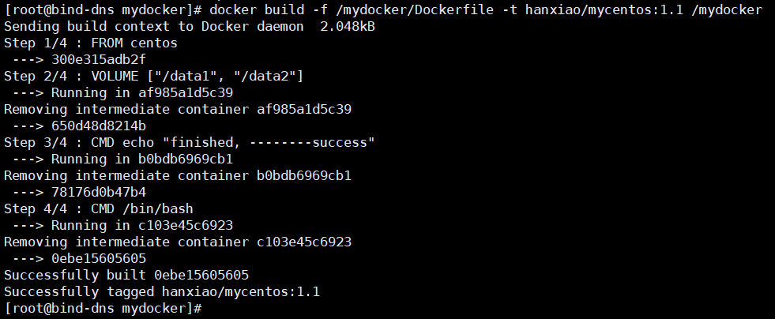
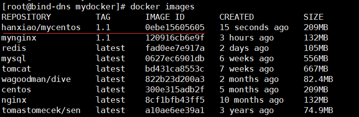
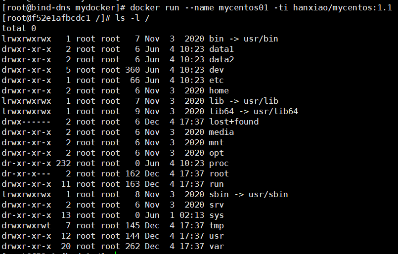
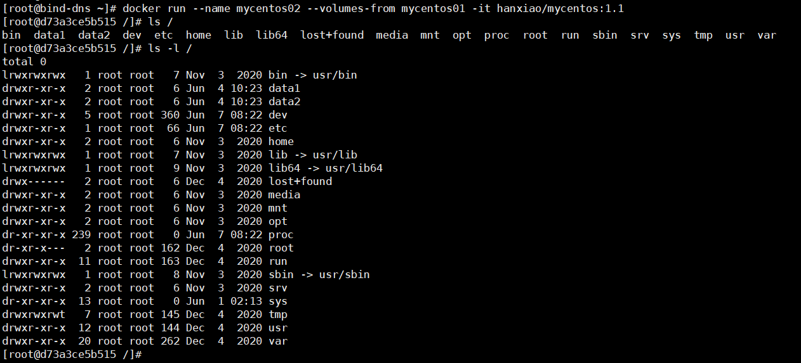

docker container volume容器数据卷
==

## Table Of Contents
* [volume数据卷是什么](#volume数据卷是什么)
* [如何添加volume数据卷](#如何添加volume数据卷)
    * [命令添加](#命令添加)
    * [Dockerfile添加](#Dockerfile添加)
* [--volumes-from挂载指定容器的数据卷](#--volumes-from挂载指定容器的数据卷)


## volume数据卷是什么
volume类似于Linux服务器上的挂载点。主要用于持久化数据

* 用途
    * 用于持久化数据
    * 容器之间继承volume，实现数据共享。


## 如何添加volume数据卷
### 命令添加
命令
```bash
docker run -v /宿主机目录或文件绝对路径:/容器目录或文件路径[:rw/ro] IMAGE
```
* 权限
    ```text
    :rw  可读写，缺省值
    :ro  只读
    ```
* -v 也可以写作 --volume，可指定多个"-v"
* /宿主机目录绝对路径的数据 与 /容器目录路径的数据 是同步。其实相当于容器中引用了宿主机上目录，类似于指针。
* 目录不需要以/结尾
* 挂载文件时，host上该文件必须存在，否则会被当作一个目录来挂载。


### Dockerfile添加
1. 创建build context的目录，即workdir

    可用于存放Dockerfile和其他数据
    ```bash
    mkdir -p /mydocker
    ```
2. 创建Dockerfile

    /mydocker/Dockerfile
    ```text
    # volume test
    FROM centos
    # 定义volume数据卷
    VOLUME ["/data1", "/data2"]
    CMD echo "finished, --------success"
    CMD /bin/bash
    ```
3. 拉取基本镜像到宿主机本地，可选。

    当本地无此镜像时，docker会自动从hub.docker.com中去拉取镜像
    ```bash
    docker pull centos
    ```
4. docker build生成镜像
    ```bash
    docker build -f /mydocker/Dockerfile -t hanxiao/mycentos:1.1 /mydocker
    ```
    * 参考`docker build [OPTIONS] PATH | URL | -`
    * PATH为执行上述命令时，pwd显示为/mydocker，可以用`.`来表示
    * -f  指定Dockerfile文件，缺省为'PATH/Dockerfile'
    * -t  指定镜像名标识，格式 'name:tag'
    
    
    生成了一个镜像：hanxiao/mycentos
    
    
5. run容器
    ```bash
    docker run --name mycentos01 -ti hanxiao/mycentos:1.1
    ```
    
    
    
    
    * 查看容器的基本信息，"Mounts"关于数据卷挂载的信息
        >docker inspect mycentos01
        
        [inspect_result](mycentos01.json)
        ```json
        [
          {
            "Name": "/mycentos01",
            ...
            "HostConfig": {
              "Binds": null
            },
            "Mounts": [
              {
                "Type": "volume",
                "Name": "6306200cc349b07bda798ba81d7a35507aba61171c4913f8f905f4fe7f828494",
                "Source": "/var/lib/docker/volumes/6306200cc349b07bda798ba81d7a35507aba61171c4913f8f905f4fe7f828494/_data",
                "Destination": "/data1",
                "Driver": "local",
                "Mode": "",
                "RW": true,
                "Propagation": ""
              },
              {
                "Type": "volume",
                "Name": "a4702555253e1b6767d49e82ddaf99023db345f89f7444a61d8bed4a4aa1c63b",
                "Source": "/var/lib/docker/volumes/a4702555253e1b6767d49e82ddaf99023db345f89f7444a61d8bed4a4aa1c63b/_data",
                "Destination": "/data2",
                "Driver": "local",
                "Mode": "",
                "RW": true,
                "Propagation": ""
              }
            ],
            "Config": {
              "Cmd": [
                "/bin/sh",
                "-c",
                "/bin/bash"
              ],
              "Image": "hanxiao/mycentos:1.1",
              "Volumes": {
                "/data1": {},
                "/data2": {}
              }
            },
            ...
          }
        ]
        ```
        当run容器没有-v指定映射数据卷时，会自动绑定到挂载点 /var/lib/docker/volumes/<VOLUME_ID>/_data
        
    * Docker挂载主机目录Docker访问出现cannot open directory .: Permission denied
        >解决办法：开启特权模式  
        在挂载目录后多加一个 --privileged=true 参数即可
        
    * run -v挂载volume示例
        ```bash
        docker run --name mysql02 -d -v /container/mysql02/lib/mysql:/var/lib/mysql -p 3307:3306 -e MYSQL_ROOT_PASSWORD=py123456 mysql
        ```
        查看容器信息
        >docker inspect mysql02
        
        [inspect_result](mysql02.json)
        ```json
        [
          {
            "HostConfig": {
              "Binds": [
                "/container/mysql02/lib/mysql:/var/lib/mysql"
              ]
            },
            "Mounts": [
              {
                "Type": "bind",
                "Source": "/container/mysql02/lib/mysql",
                "Destination": "/var/lib/mysql",
                "Mode": "",
                "RW": true,
                "Propagation": "rprivate"
              }
            ],
            "Config": {
              "Env": [
                "MYSQL_ROOT_PASSWORD=py123456",
                "PATH=/usr/local/sbin:/usr/local/bin:/usr/sbin:/usr/bin:/sbin:/bin",
                "GOSU_VERSION=1.12",
                "MYSQL_MAJOR=8.0",
                "MYSQL_VERSION=8.0.24-1debian10"
              ],
              "Volumes": {
                "/var/lib/mysql": {}
              }
            }
          },
          ...
        ]
        ```
    * Dockerfile设置的volume挂载信息 与 run -v挂载的volume 对比
        * run -v挂载的volume，
            * 有HostConfig.Binds详细绑定信息，
            * Mounts.Type为bind
            * Mounts.Propagation为rprivate，指权限传播属性
        * Dockerfile通过VOLUME设置的volume挂载信息
            * HostConfig.Binds属性为null
            * Mounts.Type为volume
            * Mounts.Propagation为""，为空

## --volumes-from挂载指定容器的数据卷
The `--volumes-from` flag mounts all the defined volumes from the referenced containers.

挂载指定容器所定义的所有数据卷，相当于多个容器共享数据卷。最根本的目的是**容器之间共享数据**

**生命周期**：只要有容器引用该数据卷时，该数据卷就不会被删除

可以指定多个`--volumes-from`，即可共享多容器定义的数据卷

**数据卷可以被多重继承**

使用场景：数据共享(几个图片服务器共享数据)、数据容器、备份还原合并数据卷
[Use volumes](https://docs.docker.com/storage/volumes)

* 语法
    >docker run --volumes-from CONTAINER[:ro /:rw /:z /:Z]
    * 权限缺省时，继承指定的容器权限模式
    * :ro  只读
    * :rw  读写
    * :z  重新标识已共享(shared)的数据卷为"可读写"，相当于:rw
    * :Z  重新标识已共享(shared)的数据卷为"private unshared"，私有不共享，只有当前容器才能使用该数据卷
* 共享数据卷示例
    ```bash
    docker run --name mycentos02 --volumes-from mycentos01 -it hanxiao/mycentos:1.1
    ```
    
    
    [inspect](mycentos02.json)
    ```json
    [
      {
        "HostConfig": {
          "Binds": null
        },
        "Mounts": [
          {
            "Type": "volume",
            "Name": "6306200cc349b07bda798ba81d7a35507aba61171c4913f8f905f4fe7f828494",
            "Source": "/var/lib/docker/volumes/6306200cc349b07bda798ba81d7a35507aba61171c4913f8f905f4fe7f828494/_data",
            "Destination": "/data1",
            "Driver": "local",
            "Mode": "",
            "RW": true,
            "Propagation": ""
          },
          {
            "Type": "volume",
            "Name": "a4702555253e1b6767d49e82ddaf99023db345f89f7444a61d8bed4a4aa1c63b",
            "Source": "/var/lib/docker/volumes/a4702555253e1b6767d49e82ddaf99023db345f89f7444a61d8bed4a4aa1c63b/_data",
            "Destination": "/data2",
            "Driver": "local",
            "Mode": "",
            "RW": true,
            "Propagation": ""
          }
        ],
        "Config": {
          "Volumes": {
            "/data1": {},
            "/data2": {}
          }
        }
      }
    ]
    ```
    /data1, /data2数据卷Source源与mycentos01的相同
    
* 数据容器
    ```bash
    docker run --name dbdata postgres echo "Data-only container for postgres"
    ```
    该命令将会创建一个已经包含在Dockerfile里定义过Volume的postgres镜像，运行echo命令然后退出。
    
    ```bash
    docker run -d --volumes-from dbdata --name db1 postgres
    ```
    
    用数据容器的两个注意点：
    * 不要运行数据容器，这纯粹是在浪费资源。
    * 不要为了数据容器而使用“最小的镜像”，  
        如busybox或scratch，只使用数据库镜像本身就可以了。你已经拥有该镜像，所以并不需要占用额外的空间。

* [备份,还原,合并数据卷示例](https://docs.docker.com/storage/volumes/#backup-restore-or-migrate-data-volumes)
    ```bash
    # 备份容器数据到宿主机
    ## 创建一个容器
    docker run -v /dbdata --name dbstore ubuntu /bin/bash
    
    ## 把上述容器中的 /dbdata 备份到 /backup/backup.tar，其实最后备至到docker 宿主机的当前目录上
    docker run --rm --volumes-from dbstore -v $(pwd):/backup ubuntu tar cvf /backup/backup.tar /dbdata
    
    
    # 还原宿主机数据到容器
    docker run -v /dbdata --name dbstore2 ubuntu /bin/bash
    docker run --rm --volumes-from dbstore2 -v $(pwd):/backup ubuntu bash -c "cd /dbdata && tar xvf /backup/backup.tar --strip 1"
```
