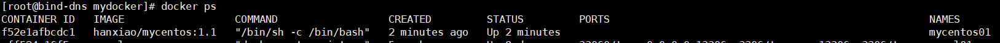

docker container volume容器数据卷
==

## volume数据卷是什么
volume类似于Linux服务器上的挂载点。主要用于持久化数据

* 用途
    * 用于持久化数据
    * 容器之间继承volume，实现数据共享。


## 如何添加数据卷
### 命令添加
命令
```bash
docker run -v /宿主机目录绝对路径:/容器目录路径[:rw/ro] IMAGE
```
* 权限
    ```text
    :rw  可读写，缺省值
    :ro  只读
    ```
* -v 也可以写作 --volume，可指定多个"-v"
* /宿主机目录绝对路径的数据 与 /容器目录路径的数据 是同步。其实相当于容器中引用了宿主机上目录，类似于指针


### Dockerfile添加
1. 创建build context的目录，即workdir

    可用于存放Dockerfile和其他数据
    ```bash
    mkdir -p /mydocker
    ```
2. 创建Dockerfile

    /mydocker/Dockerfile
    ```text
    # volume test
    FROM centos
    # 设置volume数据卷
    VOLUME ["/data1", "/data2"]
    CMD echo "finished, --------success"
    CMD /bin/bash
    ```
3. 拉取基本镜像到宿主机本地，可选。

    当本地无此镜像时，docker会自动从hub.docker.com中去拉取镜像
    ```bash
    docker pull centos
    ```
4. docker build生成镜像
    ```bash
    docker build -f /mydocker/Dockerfile -t hanxiao/mycentos:1.1 /mydocker
    ```
    * 参考`docker build [OPTIONS] PATH | URL | -`
    * PATH为执行上述命令时，pwd显示为/mydocker，可以用`.`来表示
    * -f  指定Dockerfile文件，缺省为'PATH/Dockerfile'
    * -t  指定镜像名标识，格式 'name:tag'
    
    
    生成了一个镜像：hanxiao/mycentos
    
    
5. run容器
    ```bash
    docker run --name mycentos01 -ti hanxiao/mycentos:1.1
    ```
    
    
    
    
    * 列出容器的基本信息，"Mounts"关于数据卷挂载的信息
        >docker inspect mycentos01
        
        ```bash
        [
          {
            "Name": "/mycentos01",
            ...
            "Mounts": [
              {
                "Type": "volume",
                "Name": "6306200cc349b07bda798ba81d7a35507aba61171c4913f8f905f4fe7f828494",
                "Source": "/var/lib/docker/volumes/6306200cc349b07bda798ba81d7a35507aba61171c4913f8f905f4fe7f828494/_data",
                "Destination": "/data1",
                "Driver": "local",
                "Mode": "",
                "RW": true,
                "Propagation": ""
              },
              {
                "Type": "volume",
                "Name": "a4702555253e1b6767d49e82ddaf99023db345f89f7444a61d8bed4a4aa1c63b",
                "Source": "/var/lib/docker/volumes/a4702555253e1b6767d49e82ddaf99023db345f89f7444a61d8bed4a4aa1c63b/_data",
                "Destination": "/data2",
                "Driver": "local",
                "Mode": "",
                "RW": true,
                "Propagation": ""
              }
            ],
            "Config": {
              "Cmd": [
                "/bin/sh",
                "-c",
                "/bin/bash"
              ],
              "Image": "hanxiao/mycentos:1.1",
              "Volumes": {
                "/data1": {},
                "/data2": {}
              }
            },
            ...
          }
        ]
        ```
        当run容器没有-v指定映射数据卷时，会自动绑定到挂载点 /var/lib/docker/volumes/<VOLUME_ID>/_data
        
    * Docker挂载主机目录Docker访问出现cannot open directory .: Permission denied
        >解决办法：在挂载目录后多加一个 --privileged=true 参数即可