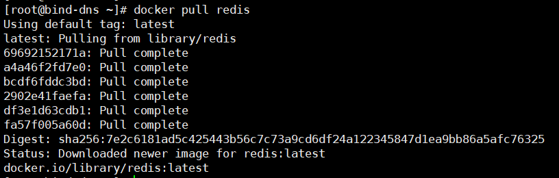

docker image（镜像）
==

## image是什么
### UnionFS
UnionFS: 联合文件系统


* UnionFS是一种分层、轻量级并且高性能的文件系统。
    * 它支持对文件系统的修改作为一次提交来一层层的叠加，类似千层饼。
    * 同时可以将不同目录挂载到同一个虚拟文件系统下(unite several directories into a single virtual filesystem)
* UnionFS是Docker镜像的基础。
* docker image下载时看到的一层一层的就是使用的这个文件系统，查看每次下载的一层是叠加还是修改，当两个镜像中的某一层已经相同就不会下载第二次
* 镜像可以通过分层来进行继承，基于基础镜像（没有父镜像），可以制作各种具体的应用镜像

* UnionFS特点
    >一次同时加载多个文件系统，但从外面看起来，只能看到一个文件系统，
     联合加载会把各层文件系统叠加起来，这样最终的文件系统会包含所有底层的文件和目录
### docker image加载原理
* docker的镜像使用了UnionFS，由一层一层的文件系统组成。
* BootFS（boot file system）
    * 主要包含bootloader、kernel。
    * bootloader主要用于引导加载kernel，完成命名空间、容器组、设备映射等工作
    * Linux刚启动时会加载bootfs文件系统
        >当boot加载完成之后整个内核就都在内存中了，此时内存的使用权已由bootfs转交给内核，系统也会卸载bootfs。
    * 在Docker镜像的最底层是bootfs。
        >这一层与Linux/Unix系统是一样的，包含bootloader、kernel。
 
* RootFS（root file system）
    * RootFS在bootfs之上
    * RootFS就是各种不同的操作系统（精简的Linux OS），比如Ubuntu，Centos等。包含OS系统中的 /dev, /proc, /bin, /etc 等标准目录和文件
    
    BootFS and RootFS  
    


* **示例**

    * Dockerfile
        ```text
        FROM debian
        RUN apt-get install -y emacs
        RUN apt-get install -y apache2
        ... ...
        EXPOSE 80
        CMD ["/usr/sbin/httpd -D FOREGROUND"]
        ```
    
    * 图示
    
    
* **为什么CentOS的ISO镜像及安装后的OS都是好几个G，而CentOS docker镜像才200M**
    
    

    ```text
    对于一个精简OS的RootFS可以很小，只需要包含最基本的命令，工具和程序库就可以了，
    因为底层直接用Host的kernel，自己只需要提供RootFS 就可以了，
    
    由此可见对于不同的 linux OS的BootFS基本是一致的(kenel)，因此不同的LinuxOS发行版可以共用BootFS。
    但RootFS会有差别。
    ```

### 镜像是分层的
如拉取redis镜像，是一层一层的拉取


* image为什么要采用分层的结构?
    ```text
    为了"共享资源"，节省硬盘空间和内存
    
    例如：有多个镜像都从相同的 base 镜像构建而来，
    那么宿主机只需在磁盘上保存一份base镜像，
    同时内存中也只需加载一份 base 镜像，就可以为所有容器服务了。
    而且镜像的每一层都可以被共享。
    ```

### 镜像都只读的
当容器启动时，一个新的"可写层"被加载到镜像的顶部。这一层通常被称作"容器层"，

"容器层"之下的都叫"镜像层"。

### 创建镜像
生成镜像有两种方式
* docker commit 容器
* 由Dockerfile文件docker build镜像

#### docker commit
Create a new image from a container's changes

以容器为副本创建镜像，相当于容器的快照。容器可以是运行的或是停止的

这是制作image的一种方式。另外一种由Dockerfile文件来构建镜像

* Usage
    ```text
    docker commit [OPTIONS] CONTAINER [REPOSITORY[:TAG]]
    
    Options:
      -a, --author string    Author (e.g., "John Hannibal Smith <hannibal@a-team.com>")
      -c, --change list      Apply Dockerfile instruction to the created image
      -m, --message string   Commit message
      -p, --pause            Pause container during commit (default true)
    ```
    * 提交时默认会暂停容器
    
    * 示例
        ```bash
        docker commit -a "Hanxiao <hanxiao2100@qq.com>" -m "Ningx with install vim" 容器ID或容器名 mynginx:1.1
        docker commit -a "Hanxiao <hanxiao2100@qq.com>" -m "Ningx with install vim" 容器ID或容器名 mynginx:latest
        ```
#### 由Dockerfile文件docker build镜像
* Dockerfile

    /mydocker/Dockerfile4
    ```text
    FROM centos
    LABEL maintainer="NGINX Docker Maintainers <docker-maint@nginx.com>"
    RUN yum install -y nginx
    RUN echo "Nginx Web: CMD defining default arguments for an ENTRYPOINT" > /usr/share/nginx/html/index.html
    EXPOSE 80
    CMD ["-g", "daemon off;"]
    ENTRYPOINT ["/usr/sbin/nginx"]
    You have new mail in /var/spool/mail/root
    [root@bind-dns mydocker]# 
    [root@bind-dns mydocker]# cat Dockerfile_nginx_4
    FROM centos
    LABEL maintainer="NGINX Docker Maintainers <docker-maint@nginx.com>"
    RUN yum install -y nginx
    RUN echo "Nginx Web: CMD defining default arguments for an ENTRYPOINT" > /usr/share/nginx/html/index.html
    EXPOSE 80
    CMD ["-g", "daemon off;"]
    ENTRYPOINT ["/usr/sbin/nginx"]
    ```
* 构建镜像
    ```bash
    docker build -f /mydocker/Dockerfile_nginx_4 -t hanxiao/mynginx:4.1 /mydocker
    ```
* 测试镜像
    ```bash
    docker run -d --name mynginx -p 5003:80 hanxiao/mynginx:4.1
    ```
    
    * 浏览器访问 http://<IP>:5003，访问正常