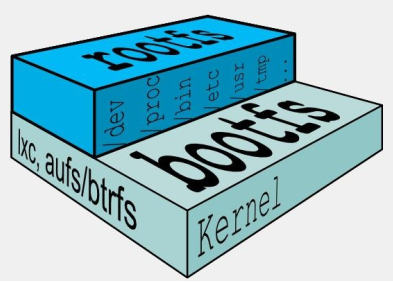
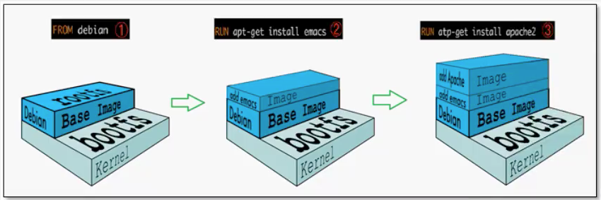
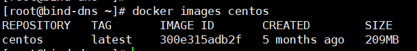

docker image（镜像）
==

## image是什么
### UnionFS
UnionFS: 联合文件系统


* UnionFS是一种分层、轻量级并且高性能的文件系统。
    * 它支持对文件系统的修改作为一次提交来一层层的叠加，类似千层饼。
    * 同时可以将不同目录挂载到同一个虚拟文件系统下(unite several directories into a single virtual filesystem)
* UnionFS是Docker镜像的基础。
* docker image下载时看到的一层一层的就是使用的这个文件系统，查看每次下载的一层是叠加还是修改，当两个镜像中的某一层已经相同就不会下载第二次
* 镜像可以通过分层来进行继承，基于基础镜像（没有父镜像），可以制作各种具体的应用镜像

* UnionFS特点
    >一次同时加载多个文件系统，但从外面看起来，只能看到一个文件系统，
     联合加载会把各层文件系统叠加起来，这样最终的文件系统会包含所有底层的文件和目录
### docker image加载原理
* docker的镜像使用了UnionFS，由一层一层的文件系统组成。
* BootFS（boot file system）
    * 主要包含bootloader、kernel。
    * bootloader主要用于引导加载kernel，完成命名空间、容器组、设备映射等工作
    * Linux刚启动时会加载bootfs文件系统
        >当boot加载完成之后整个内核就都在内存中了，此时内存的使用权已由bootfs转交给内核，系统也会卸载bootfs。
    * 在Docker镜像的最底层是bootfs。
        >这一层与Linux/Unix系统是一样的，包含bootloader、kernel。
 
* RootFS（root file system）
    * RootFS在bootfs之上
    * RootFS就是各种不同的操作系统（精简的Linux OS），比如Ubuntu，Centos等。包含OS系统中的 /dev, /proc, /bin, /etc 等标准目录和文件
    
    BootFS and RootFS  
    


**示例**

* Dockerfile
    ```text
    FROM debian
    RUN apt-get install -y emacs
    RUN apt-get install -y apache2
    ... ...
    EXPOSE 80
    CMD ["/usr/sbin/httpd -D FOREGROUND"]
    ```

    
    
为什么我们安装的CentOS都是好几个G，CentOS docker镜像才200M


```text
对于一个精简OS的RootFS可以很小，只需要包含最基本的命令，工具和程序库就可以了，
因为底层直接用Host的kernel，自己只需要提供RootFS 就可以了，
由此可见对于不同的 linux OS的BootFS基本是一致的(kenel)，因此不同的LinuxOS发行版可以共用BootFS。
但RootFS会有差别。
```


