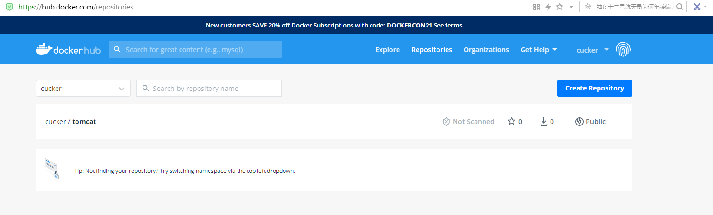

将docker本地镜像推送到hub.docker.com
==

## 参考文档
* [Docker ID accounts](https://docs.docker.com/docker-id/)
* [Docker Hub Quickstart](https://docs.docker.com/docker-hub/)
* [Repositories](https://docs.docker.com/docker-hub/repos/)

## 1.注册docker hub帐号登录，创建repository仓库


## 2.准备推送的镜像
选择其中的一种方式生成镜像

* 构建镜像
    ```bash
    docker build -f DockerfilePATH -t <hub-user>/<repo-name>[:<tag>] PATH
    ```

* 对已经存在的镜像再加标签（取别名）
    ```bash
    docker tag <existing-image> <hub-user>/<repo-name>[:<tag>]
    ```
    
* 提交已经存在的容器
    ```bash
    docker commit <existing-container> <hub-user>/<repo-name>[:<tag>]
    ```
    
## 3.在docker宿主机登录dockerhub
```bash
$ docker login
Login with your Docker ID to push and pull images from Docker Hub. If you don't have a Docker ID, head over to https://hub.docker.com to create one.
Username: cucker  ## 输入dockerhub ID
Password:         ## 输入密码
WARNING! Your password will be stored unencrypted in /root/.docker/config.json.
Configure a credential helper to remove this warning. See
https://docs.docker.com/engine/reference/commandline/login/#credentials-store

Login Succeeded
```
docker login 省略登录地址，默认是 `hub.docker.com`

## 4.推送镜像
```bash
docker push <hub-user>/<repo-name>:<tag>
```
默认向`hub.docker.com`推送。所以镜像名中也没有以仓库域名开头来命名。

## 示例
* 操作日志
    ```bash
    [root@bind-dns web]# docker login
    Login with your Docker ID to push and pull images from Docker Hub. If you don't have a Docker ID, head over to https://hub.docker.com to create one.
    Username: cucker
    Password: 
    WARNING! Your password will be stored unencrypted in /root/.docker/config.json.
    Configure a credential helper to remove this warning. See
    https://docs.docker.com/engine/reference/commandline/login/#credentials-store
    
    Login Succeeded
    [root@bind-dns web]# docker images
    REPOSITORY               TAG       IMAGE ID       CREATED         SIZE
    hanxiao2100/tomcat       10        17a9f513eca2   2 hours ago     537MB
    [root@bind-dns web]#
    [root@bind-dns web]# docker tag 17a9f513eca2 cucker/tomcat:10.0
    [root@bind-dns web]# docker push cucker/tomcat:10.0
    The push refers to repository [docker.io/cucker/tomcat]
    354f0bceb5d5: Pushed 
    86cea5f5542c: Pushed 
    8dc6e2462031: Pushed 
    2653d992f4ef: Mounted from library/centos 
    10.0: digest: sha256:ce6d7c5af935402e017b8d1e5be7ba4dcd8325b5e93d5724e9b7bd0d5bc5dbd9 size: 1161
    ```

* 查看dockerhub控制台
    
    
* 拉取镜像
    ```bash
    docker pull cucker/tomcat:10.0
    ```
