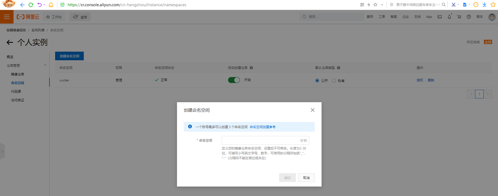
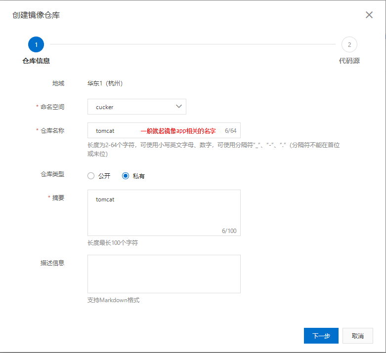
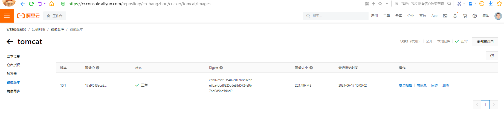

将本地镜像推送到阿里云
==

## 准备知识
* 生成镜像的方法
    * 由Dockerfile构建生成
        ```bash
        docker build -f Dockerfile_PATH -t name[:tag] PATH
        ```
    * 由容器创建一个新的镜像
        ```bash
        docker commit [OPTIONS] CONTAINER [REPOSITORY[:TAG]]
        ```
* 阿里云Docker生态图
    

## 准备工作
* 准备推送的镜像
    ```text
    $ docker images
    REPOSITORY               TAG       IMAGE ID       CREATED         SIZE
    hanxiao2100/tomcat       10        17a9f513eca2   2 hours ago     537MB
    ```

* 登录aliyun控制台，完成下列操作
    * 创建实例（容器镜像服务）
          
        
    * 设置Registry登录密码
          
        
        也可以在"访问凭证"页面设置 固定密码
    * 创建命名空间
        
    * 创建镜像仓库
                  
          
          

## 镜像拉取、推送操作指南


1. 登录阿里云Docker Registry
    ```bash
    $ $ docker login --username=hanxiao****@qq.com registry.cn-hangzhou.aliyuncs.com
    ```
    用于登录的用户名为阿里云账号全名，密码为开通服务时设置的密码。
    
    您可以在"访问凭证"页面修改凭证密码。

2. 从Registry中拉取镜像
    ```bash
    $ docker pull registry.cn-hangzhou.aliyuncs.com/cucker/tomcat:[镜像版本号]
    ```
3. 将镜像推送到Registry
    ```bash
    $ docker login --username=hanxiao****@qq.com registry.cn-hangzhou.aliyuncs.com
    $ docker tag [ImageId] registry.cn-hangzhou.aliyuncs.com/cucker/tomcat:[镜像版本号]
    $ docker push registry.cn-hangzhou.aliyuncs.com/cucker/tomcat:[镜像版本号]
    ```
    请根据实际镜像信息替换示例中的[ImageId]和[镜像版本号]参数。

4. 选择合适的镜像仓库地址

    从ECS推送镜像时，可以选择使用镜像仓库内网地址。推送速度将得到提升并且将不会损耗您的公网流量。
    
    如果您使用的机器位于VPC网络，请使用 registry-vpc.cn-hangzhou.aliyuncs.com 作为Registry的域名登录。

5. 示例

    使用"docker tag"命令重命名镜像，并将它通过专有网络地址推送至Registry。
    ```bash
    $ docker images
    REPOSITORY                                                         TAG                 IMAGE ID            CREATED             VIRTUAL SIZE
    registry.aliyuncs.com/acs/agent                                    0.7-dfb6816         37bb9c63c8b2        7 days ago          37.89 MB
    $ docker tag 37bb9c63c8b2 registry-vpc.cn-hangzhou.aliyuncs.com/acs/agent:0.7-dfb6816
    ```

    使用 "docker push" 命令将该镜像推送至远程。
    ```bash
    $ docker push registry-vpc.cn-hangzhou.aliyuncs.com/acs/agent:0.7-dfb6816
    ```

实测示例
1. 登录阿里云Docker Registry
    ```bash
    docker login --username=hanxiao2100@qq.com registry.cn-hangzhou.aliyuncs.com
    ```
    Password:输入密码
    
    提示"Login Succeeded"，表示成功。显示token保存在`/root/.docker/config.json`

2. 给需要推送的镜像的标签（取别名）
    ```bash'
    $ docker tag 17a9f513eca2 registry.cn-hangzhou.aliyuncs.com/cucker/tomcat:10.1
    ```
    * 可查看打标签的镜像
        ```bash
        # docker images
        REPOSITORY                                                        TAG       IMAGE ID       CREATED         SIZE
        registry.cn-hangzhou.aliyuncs.com/cucker/tomcat                   10.1      17a9f513eca2   18 hours ago    537MB
        hanxiao2100/tomcat                                                10        17a9f513eca2   18 hours ago    537MB
        ```
    * 取消打标签（如果需要）
        ```bash
        docker rmi registry.cn-hangzhou.aliyuncs.com/cucker/tomcat:10.1
        ```
3. 推送镜像
    ```bash
    $ docker push registry.cn-hangzhou.aliyuncs.com/cucker/tomcat:10.1
    The push refers to repository [registry.cn-hangzhou.aliyuncs.com/cucker/tomcat]
    354f0bceb5d5: Pushed 
    86cea5f5542c: Pushed 
    8dc6e2462031: Pushed 
    2653d992f4ef: Pushed 
    10.1: digest: sha256:ce6d7c5af935402e017b8d1e5be7ba4dcd8325b5e93d5724e9b7bd0d5bc5dbd9 size: 1161
    ```
    docker push为什么知道是推送到"阿里云"的呢?  
    因为上一步的tag打标签时，REPOSITORY名中包含了目的地址`registry.cn-hangzhou.aliyuncs.com`
    
4. 阿里云控制台的镜像仓库查看镜像
    

5. 测试镜像
    ```bash
    docker pull registry.cn-hangzhou.aliyuncs.com/cucker/tomcat:10.1
    docker run --rm -p 6600:8080 registry.cn-hangzhou.aliyuncs.com/cucker/tomcat:10.1
    ```
    访问 http://<宿主机IP>:6600

**push时提示请求拒绝**
```text
denied: requested access to the resource is denied
```

* docker tag给镜像打标签时，请严格按照"镜像拉取、推送操作指南"的第3步
* 登录和tag时的registry域名要相同
