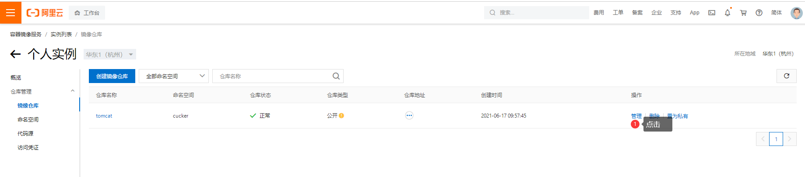

将本地镜像推送到阿里云
==

## 准备知识
* 生成镜像的方法
    * 由Dockerfile构建生成
        ```bash
        docker build -f Dockerfile_PATH -t name[:tag] PATH
        ```
    * 由容器创建一个新的镜像
        ```bash
        docker commit [OPTIONS] CONTAINER [REPOSITORY[:TAG]]
        ```
* 阿里云Docker生态图
    

## 准备工作
* 准备推送的镜像
    ```text
    $ docker images
    REPOSITORY               TAG       IMAGE ID       CREATED         SIZE
    hanxiao2100/tomcat       10        17a9f513eca2   2 hours ago     537MB
    ```

* 登录aliyun控制台，完成下列操作
    * 创建实例（容器镜像服务）
        
        
    * 设置Registry登录密码
        
        
    * 创建命名空间
    * 创建镜像仓库
        
        
        

## 镜像拉取、推送操作指南
1. 登录阿里云Docker Registry
    ```bash
    $ docker login --username=hanxiao****@qq.com registry.cn-hangzhou.aliyuncs.com
    ```
    用于登录的用户名为阿里云账号全名，密码为开通服务时设置的密码。
    
    您可以在访问凭证页面修改凭证密码。

2. 从Registry中拉取镜像
    ```bash
    $ docker pull registry.cn-hangzhou.aliyuncs.com/cucker/pub:[镜像版本号]
    ```
3. 将镜像推送到Registry
    ```bash
    $ docker login --username=hanxiao****@qq.com registry.cn-hangzhou.aliyuncs.com
    $ docker tag [ImageId] registry.cn-hangzhou.aliyuncs.com/cucker/pub:[镜像版本号]
    $ docker push registry.cn-hangzhou.aliyuncs.com/cucker/pub:[镜像版本号]
    ```
    请根据实际镜像信息替换示例中的[ImageId]和[镜像版本号]参数。

4. 选择合适的镜像仓库地址

    从ECS推送镜像时，可以选择使用镜像仓库内网地址。推送速度将得到提升并且将不会损耗您的公网流量。
    
    如果您使用的机器位于VPC网络，请使用 registry-vpc.cn-hangzhou.aliyuncs.com 作为Registry的域名登录。

5. 示例

    使用"docker tag"命令重命名镜像，并将它通过专有网络地址推送至Registry。
    ```bash
    $ docker images
    REPOSITORY                                                         TAG                 IMAGE ID            CREATED             VIRTUAL SIZE
    registry.aliyuncs.com/acs/agent                                    0.7-dfb6816         37bb9c63c8b2        7 days ago          37.89 MB
    $ docker tag 37bb9c63c8b2 registry-vpc.cn-hangzhou.aliyuncs.com/acs/agent:0.7-dfb6816
    ```

    使用 "docker push" 命令将该镜像推送至远程。
    ```bash
    $ docker push registry-vpc.cn-hangzhou.aliyuncs.com/acs/agent:0.7-dfb6816
    ```

```text
denied: requested access to the resource is denied
```
